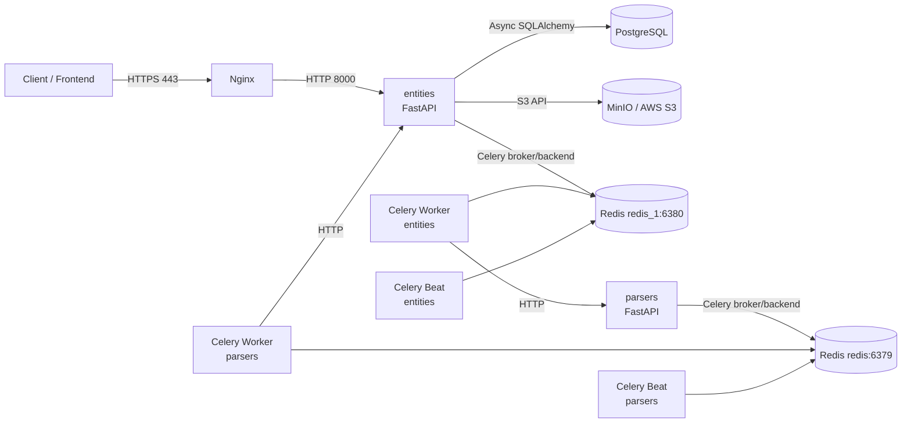
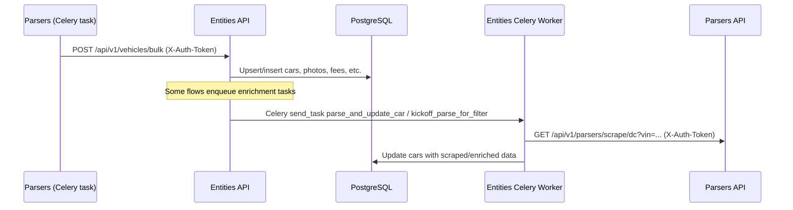
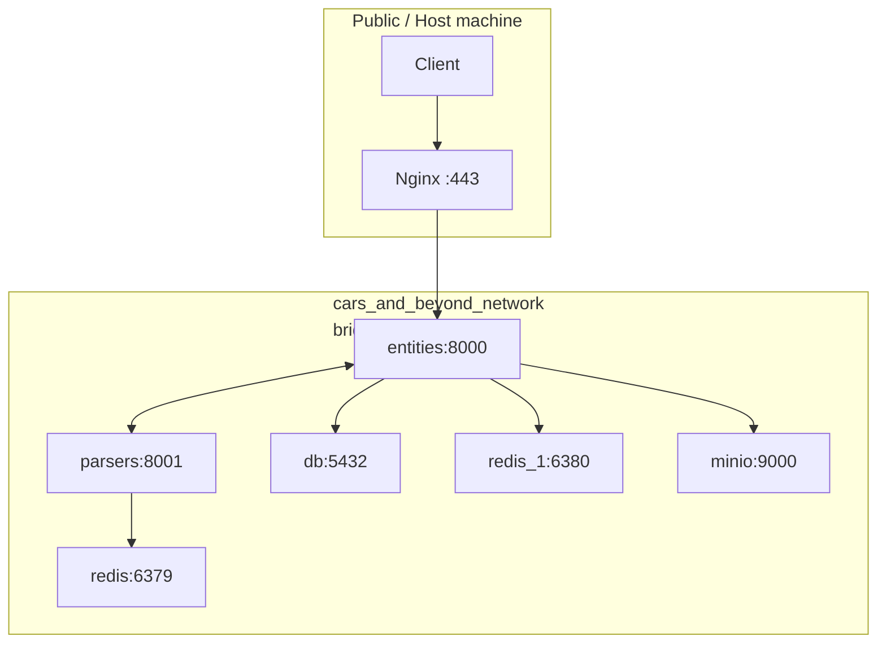
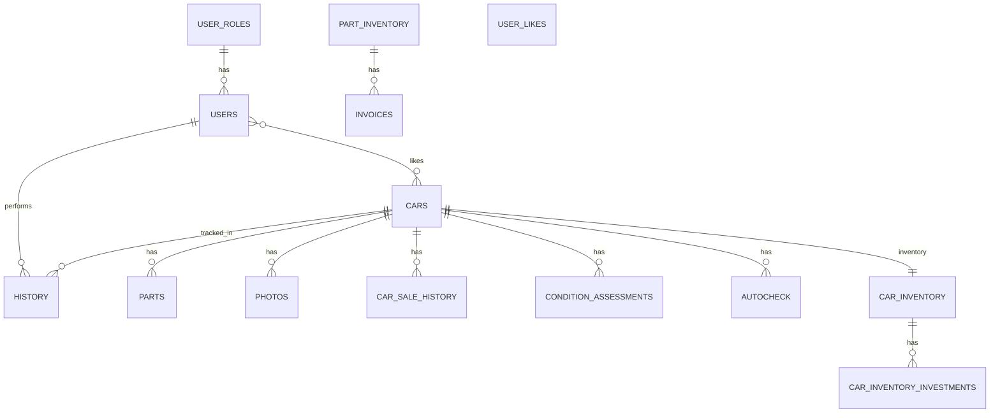
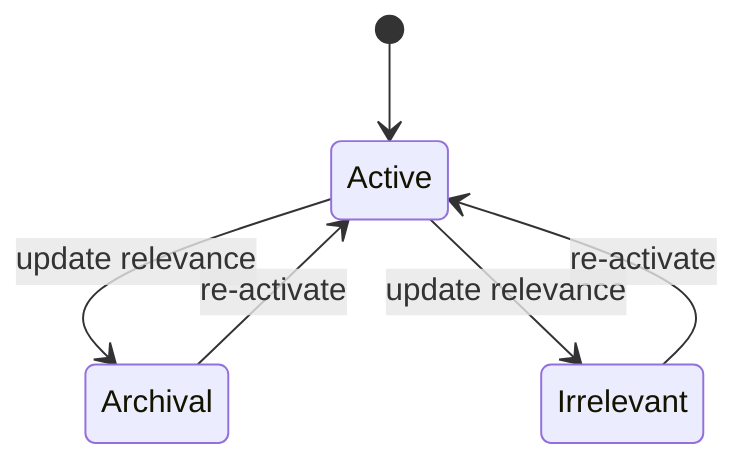
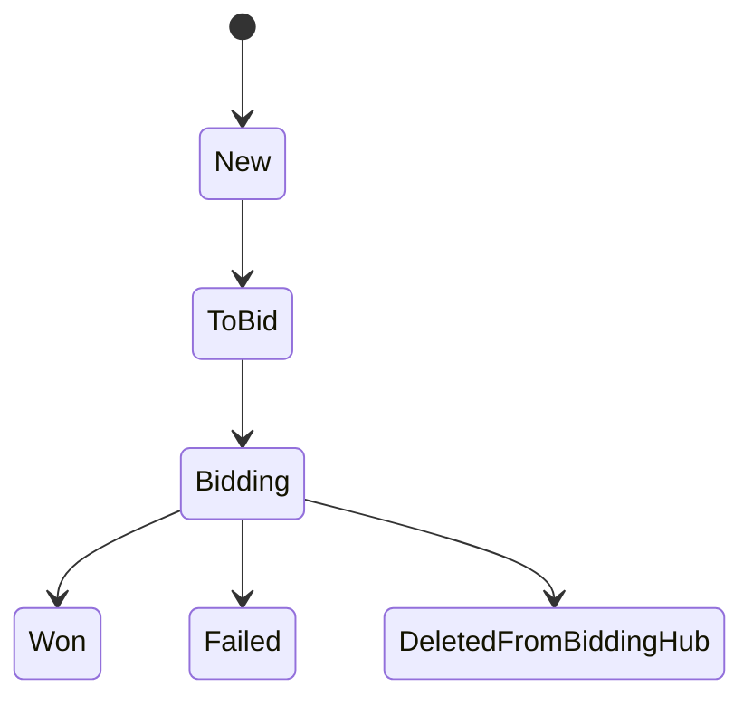
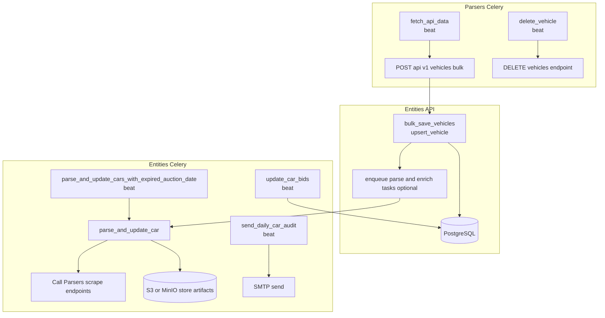
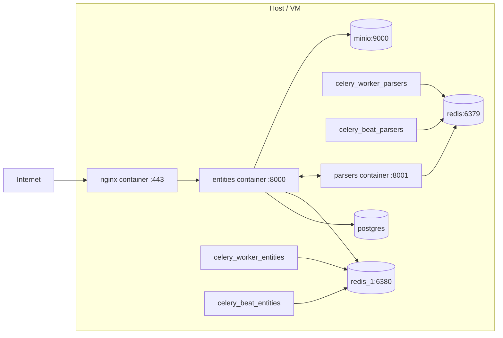

# Table of Contents

- [1. Project Overview](#1-project-overview)
- [2. Technology Stack](#2-technology-stack)
- [3. High-Level Architecture](#3-high-level-architecture)
- [4. Project Structure](#4-project-structure)
- [5. Data Models & Database Design](#5-data-models--database-design)
- [6. API Documentation](#6-api-documentation)
- [7. Vehicle Lifecycle & Processing Pipeline (CRITICAL SECTION)](#7-vehicle-lifecycle--processing-pipeline-critical-section)
- [8. Business Logic](#8-business-logic)
- [9. Authentication & Authorization](#9-authentication--authorization)
- [10. Background Processing System](#10-background-processing-system)
- [11. Configuration & Environment](#11-configuration--environment)
- [12. Storage Layer](#12-storage-layer)
- [13. Deployment & Infrastructure](#13-deployment--infrastructure)
- [14. Error Handling & Logging](#14-error-handling--logging)
- [15. Testing](#15-testing)
- [16. Performance & Scalability](#16-performance--scalability)
- [17. Development & Extension Guide](#17-development--extension-guide)
- [18. Known Limitations & Technical Debt](#18-known-limitations--technical-debt)
- [19. Recommendations](#19-recommendations)
- [20. Diagrams Collection](#20-diagrams-collection)

# Cars & Beyond Backend System — Technical Documentation

Repository name in archive: user_registration

This document is generated strictly from the code contained in the provided archive. Where information is not present in code/configs, it is explicitly marked as Not found in code.

## 1. Project Overview
System purpose

Provides backend APIs and background processing for a vehicle-centric platform named Cars&Beyond.

Manages vehicle records, vehicle enrichment (scraping/decoding), bidding hub workflows, inventories, and analytics.

Business domain

Automotive auctions / vehicle sourcing (Copart/IAAI/other) and downstream decision support (fees, ROI, recommendations).

Core functionality (as implemented)

User registration/login and role-based access control.

Vehicle ingestion (bulk + upsert), retrieval (list/detail), and update flows.

Vehicle enrichment via a separate Parsers service (DealerCenter scraper, current bid scraper, fees parsers, external API ingestion).

Background processing via Celery for periodic bid updates, enrichment, fee updates, filter kickoffs, and daily audit notifications.

Inventory management for cars/parts, invoices, and status tracking.

File/object storage for scraped HTML and images via S3-compatible storage (MinIO in dev, S3 in prod).

Serve through a reverse proxy with TLS termination and BasicAuth protection for API docs (Nginx).

Main user roles (inferable)

user: default end-user role.

vehicle_manager: vehicle management role.

part_manager: part/inventory management role.

admin: administrative role.

High-level system responsibilities

Expose HTTP APIs (FastAPI) for user and vehicle-related operations.

Persist and query domain data in PostgreSQL via SQLAlchemy (async in API, sync in Celery tasks).

Run asynchronous/background workflows (Celery + Redis) for enrichment and periodic maintenance.

Integrate with external data sources (APICAR API, DealerCenter scraping, auction fees/current bid scraping).

Serve through a reverse proxy with TLS termination and BasicAuth protection for /docs, /redoc, /openapi.json.

## 2. Technology Stack
Languages

Python (primary language across both services).

Frameworks & Libraries

FastAPI: HTTP API layer for both entities and parsers services.

Pydantic: request/response schemas and configuration models (core/config.py, schemas/*).

SQLAlchemy:

Async SQLAlchemy (sqlalchemy.ext.asyncio) in the entities HTTP service.

Sync SQLAlchemy (engine/session) in entities Celery tasks for performance and simplicity in workers.

Alembic: database migrations in entities/db/migrations.

Celery: background jobs in both services:

entities: Celery with Redis broker/backend on redis_1:6380.

parsers: Celery with Redis broker/backend on redis:6379.

Redis: broker/backend for Celery; two Redis instances are deployed in Docker Compose (redis, redis_1).

httpx: HTTP client for service-to-service calls and external API calls.

passlib (bcrypt): password hashing/verification.

python-dotenv: .env configuration loading.

pytest: testing framework (unit + integration).

Databases

PostgreSQL (Docker: postgres:15.6): primary relational database for entities.

pgadmin4: included for local DB administration.

Storage

S3-compatible object storage:

MinIO in local/dev compose.

AWS S3 in production (configurable via env vars).

Used for storing scraped artifacts (e.g., HTML) and potentially images/screenshots (see storages/s3.py, Celery tasks).

Infrastructure & Tooling

Docker / Docker Compose: local and production-like orchestration (compose.yaml, compose.prod.yaml).

Nginx: TLS termination and reverse proxy; Basic Auth for /docs, /redoc, /openapi.json.

External APIs / Integrations (as referenced in code)

APICAR (https://api.apicar.store/api/cars/db/...) via parsers and entities tasks.

DealerCenter scraping (via parsers/services/parsers/dc_scraper*.py).

Auction-related scraping/parsing:

Copart fees scraping (parsers/services/fees/copart_fees_parser.py).

IAAI fees parsing from uploaded image (parsers/services/fees/iaai_fees_image_parser.py).

Current bid scraping (parsers/services/parsers/cd current bid parser).

Email (SMTP): outgoing email configuration present; used for audit or notifications (services/email*.py).

## 3. High-Level Architecture
Architectural style

Microservices (2 services) + shared infrastructure:

entities: primary domain API + persistence + business logic + background processing.

parsers: specialized scraping/ingestion service + its own Celery jobs.

Services and responsibilities
entities service

Auth (registration/login), user management, role management.

Vehicle CRUD, filtering/search, enrichment orchestration, and analytics endpoints.

Inventory, bidding hub workflows, fees endpoints.

Runs Celery workers/beat to periodically update bids, process expired auctions, update fees, send audits, and kickoff parsing for filters.

parsers service

Provides scraping endpoints (DealerCenter scrape, current bid scrape).

Provides fee parsing endpoints (Copart scraping, IAAI fee table parsing from image).

Runs Celery beat to continuously ingest vehicle updates from APICAR and forward them to entities in bulk, and to trigger deletion logic.

Internal communication patterns

HTTP (service-to-service):

entities Celery task parse_and_update_car calls parsers endpoints (e.g., /api/v1/parsers/scrape/dc, and apicar/get/{vin}) using httpx with an internal token header (X-Auth-Token).

parsers Celery task fetch_api_data forwards processed payloads to entities bulk endpoint (HTTP).

Redis (async messaging): Celery broker/backends for both services.

Network boundaries

Nginx exposes entities on TLS port 443 and proxies traffic to entities:8000.

Internal Docker network cars_and_beyond_network connects services, DB, Redis, MinIO.

Mermaid diagrams
System architecture

Service communication

Network boundaries (Docker Compose)


## 4. Project Structure
```mermaid
Directory tree (depth-limited)
user_registration/
├── commands/
│   ├── run_entities_server_dev.sh
│   ├── run_migration.sh
│   ├── run_parsers_server_dev.sh
│   ├── set_nginx_basic_auth.sh
│   └── setup_minio.sh
├── configs/
│   └── nginx/
│       ├── static/
│       │   └── robots.txt
│       ├── nginx.conf
│       └── nginx_local.conf
├── docker/
│   ├── minio_mc/
│   │   └── Dockerfile
│   └── nginx/
│       ├── .env
│       └── Dockerfile
├── entities/
│   ├── api/
│   │   ├── v1/
│   │   │   ├── routers/
│   │   │   └── __init__.py
│   │   └── __init__.py
│   ├── audit_logs/
│   ├── core/
│   │   ├── security/
│   │   │   ├── __init__.py
│   │   │   ├── interfaces.py
│   │   │   ├── passwords.py
│   │   │   ├── token_manager.py
│   │   │   └── utils.py
│   │   ├── __init__.py
│   │   ├── celery_config.py
│   │   ├── config.py
│   │   ├── dependencies.py
│   │   └── setup.py
│   ├── crud/
│   │   ├── __init__.py
│   │   ├── inventory.py
│   │   ├── user.py
│   │   └── vehicle.py
│   ├── db/
│   │   ├── migrations/
│   │   │   ├── versions/
│   │   │   ├── env.py
│   │   │   ├── README
│   │   │   └── script.py.mako
│   │   ├── __init__.py
│   │   ├── session.py
│   │   └── test_session.py
│   ├── exceptions/
│   │   ├── __init__.py
│   │   ├── email.py
│   │   ├── security.py
│   │   └── storage.py
│   ├── models/
│   │   ├── validators/
│   │   │   ├── __init__.py
│   │   │   └── user.py
│   │   ├── __init__.py
│   │   ├── admin.py
│   │   ├── user.py
│   │   └── vehicle.py
│   ├── schemas/
│   │   ├── __init__.py
│   │   ├── admin.py
│   │   ├── inventory.py
│   │   ├── message.py
│   │   ├── user.py
│   │   └── vehicle.py
│   ├── services/
│   │   ├── __init__.py
│   │   ├── auth.py
│   │   ├── car_audit.py
│   │   ├── cookie.py
│   │   ├── email.py
│   │   ├── email_sync.py
│   │   ├── lock.py
│   │   ├── makes_and_models.py
│   │   ├── user.py
│   │   └── vehicle.py
│   ├── storages/
│   │   ├── __init__.py
│   │   ├── interfaces.py
│   │   └── s3.py
│   ├── tasks/
│   │   ├── task.py
│   │   └── __init__.py
│   ├── tests/
│   │   ├── integration/
│   │   ├── unit/
│   │   ├── conftest.py
│   │   └── __init__.py
│   ├── alembic.ini
│   ├── Dockerfile
│   ├── init.sql
│   └── main.py
├── parsers/
│   ├── api/
│   │   ├── v1/
│   │   │   ├── routers/
│   │   │   └── __init__.py
│   │   └── __init__.py
│   ├── core/
│   │   ├── __init__.py
│   │   ├── config.py
│   │   └── dependencies.py
│   ├── schemas/
│   │   ├── __init__.py
│   │   └── schemas.py
│   ├── services/
│   │   ├── convert/
│   │   ├── fees/
│   │   ├── parsers/
│   │   └── __init__.py
│   ├── tasks/
│   │   ├── tasks.py
│   │   └── __init__.py
│   ├── tests/
│   │   ├── test_copart_fees.py
│   │   ├── test_dealercenter_scraper.py
│   │   └── test_iaai_fees.py
│   ├── Dockerfile
│   └── main.py
├── compose.yaml
├── compose.prod.yaml
└── README.md
Major modules
Root
```

compose.yaml, compose.prod.yaml: local/dev vs prod-oriented Docker Compose definitions.

commands/: helper scripts for running services, migrations, MinIO initialization, and Nginx basic auth generation.

configs/nginx/: Nginx configs, including local TLS reverse proxy and static files.

docker/: Dockerfiles for Nginx and MinIO client helper.

entities/ (primary domain service)

main.py: FastAPI application, router registration, CORS, and IntegrityError handler.

api/v1/routers/: HTTP API routes grouped by domain (auth, user, vehicle, inventory, admin, etc.).

models/: SQLAlchemy ORM models (cars, users, inventory, etc.).

schemas/: Pydantic models for request/response payloads.

crud/: DB access layer (queries, upserts, bulk operations, filtering).

services/: business services (vehicle enrichment orchestration, cookie utils, email, auditing, locks).

tasks/: Celery tasks executed by worker/beat.

storages/: S3 client abstraction.

db/: async session factory + Alembic migrations.

tests/: unit + integration tests.

parsers/ (scraping/ingestion service)

main.py: FastAPI app; routes for parsers and APICAR, plus a manual /startup endpoint to kick off ingestion task.

api/v1/routers/: parsers endpoints (DealerCenter scrape, fees parsing) and APICAR proxy endpoints.

services/: scraping logic, parsers, fee parsers, and formatters.

tasks/: Celery tasks to fetch APICAR data and forward to entities; delete vehicles job.

tests/: scraper/fee parsing tests.

## 5. Data Models & Database Design
Enums
CarInventoryInvestmentsType
Name	Value
AUCTION_FEE	auction_fee
TRANSPORTATION	transportation
LABOR	labor
MAINTENANCE	maintenance
PARTS_COST	parts_cost
CarInventoryStatus
Name	Value
AVAILABLE	Available
ON_HOLD	On hold
SOLD	Sold
CarStatus
Name	Value
NEW	New
TO_BID	To Bid
BIDDING	Bidding
WON	Won
FAILED	Failed
DELETED_FROM_BIDDING_HUB	Deleted from Bidding Hub
PartInventoryStatus
Name	Value
AVAILABLE	Available
ON_HOLD	On hold
SOLD	Sold
RecommendationStatus
Name	Value
RECOMMENDED	recommended
NOT_RECOMMENDED	not_recommended
RelevanceStatus
Name	Value
ACTIVE	Active
ARCHIVAL	Archival
IRRELEVANT	Irrelevant
UserRoleEnum
Name	Value
USER	user
VEHICLE_MANAGER	vehicle_manager
PART_MANAGER	part_manager
ADMIN	admin
ORM Models (SQLAlchemy)
FilterModel

Table: filters

Field	Type	Key options
id	Integer	primary_key=True, index=True
make	String	nullable=True
model	String	nullable=True
year_from	Integer	nullable=True
year_to	Integer	nullable=True
odometer_min	Integer	nullable=True
odometer_max	Integer	nullable=True
updated_at	DateTime	nullable=True
ROIModel

Table: roi

Field	Type	Key options
id	Integer	primary_key=True, index=True
roi	Float	nullable=False
profit_margin	Float	nullable=False
created_at	DateTime	nullable=True, default=func.now()
UserRoleModel

Table: user_roles

Field	Type	Key options
id	Integer	primary_key=True, autoincrement=True
name	Enum	nullable=False, unique=True

Relationships

users = relationship('UserModel', back_populates='role')

UserModel

Table: users

Field	Type	Key options
id	Integer	primary_key=True
first_name	String	nullable=True
last_name	String	nullable=True
phone_number	String	nullable=True
date_of_birth	Date	nullable=True
email	String	unique=True, nullable=False
temp_email	String	nullable=True
_hashed_password	String	nullable=False
role_id	ForeignKey	

Relationships

history = relationship('HistoryModel', back_populates='user', cascade='all, delete-orphan')

role = relationship('UserRoleModel', back_populates='users')

liked_cars = relationship('CarModel', secondary=user_likes, back_populates='liked_by')

Indexes

Index('ix_users_email', 'email', unique=True)

CarModel

Table: cars

Field	Type	Key options
id	Integer	primary_key=True, index=True
vin	String	unique=True, nullable=False, index=True
vehicle	String	nullable=False
year	Integer	nullable=True
make	String	nullable=True
model	String	nullable=True
mileage	Integer	nullable=True, index=True
auction	String	nullable=True
auction_name	String	nullable=True
date	DateTime	timezone=True, nullable=True
lot	Integer	nullable=True
seller	String	nullable=True
seller_type	String	nullable=True
owners	Integer	nullable=True
location	String	nullable=True
engine_title	String	nullable=True
accident_count	Integer	nullable=True
has_correct_vin	Boolean	nullable=False, default=False
has_correct_owners	Boolean	nullable=False, default=False
has_correct_accidents	Boolean	nullable=False, default=False
has_correct_mileage	Boolean	nullable=False, default=False
current_bid	Float	nullable=True
actual_bid	Float	nullable=True
price_sold	Float	nullable=True
suggested_bid	Float	nullable=True
avg_market_price	Integer	nullable=True
fuel_type	String	nullable=True
attempts	Integer	nullable=False, default=0, server_default='0'
is_checked	Boolean	default=False
is_manually_upserted	Boolean	default=False
parts_cost	Float	nullable=True
maintenance	Float	nullable=True
auction_fee	Float	nullable=True
transportation	Float	nullable=True
labor	Float	nullable=True
is_salvage	Boolean	default=False
parts_needed	String	nullable=True
recommendation_status	Enum	nullable=False, default=RecommendationStatus.NOT_RECOMMENDED
recommendation_status_reasons	String	nullable=True
car_status	Enum	nullable=False, default=CarStatus.NEW
relevance	Enum	nullable=True, index=True
engine	Float	nullable=True
has_keys	Boolean	default=False
predicted_roi	Float	nullable=True
predicted_profit_margin	Float	nullable=True
predicted_profit_margin_percent	Float	nullable=True
predicted_total_investments	Float	nullable=True
roi	Float	nullable=True
profit_margin	Float	nullable=True
engine_cylinder	Integer	nullable=True
drive_type	String	nullable=True
interior_color	String	nullable=True
exterior_color	String	nullable=True
body_style	String	nullable=True
style_id	Integer	nullable=True
transmision	String	nullable=True
vehicle_type	String	nullable=True
link	String	nullable=True
created_at	DateTime	nullable=True, default=func.now()
condition	String	nullable=True

Relationships

inventory = relationship('CarInventoryModel', back_populates='car', uselist=False, cascade='all, delete-orphan')

auto_checks = relationship('AutoCheckModel', back_populates='car', cascade='all, delete-orphan')

parts = relationship('PartModel', back_populates='car', cascade='all, delete-orphan')

photos = relationship('PhotoModel', primaryjoin="and_(CarModel.id == PhotoModel.car_id, PhotoModel.is_hd == False)", back_populates='car_low_res', cascade='all, delete-orphan')

photos_hd = relationship('PhotoModel', primaryjoin="and_(CarModel.id == PhotoModel.car_id, PhotoModel.is_hd == True)", back_populates='car_high_res', cascade='all, delete-orphan')

bidding_hub_history = relationship('HistoryModel', back_populates='car', cascade='all, delete-orphan')

condition_assessments = relationship('ConditionAssessmentModel', back_populates='car', cascade='all, delete-orphan')

sales_history = relationship('CarSaleHistoryModel', back_populates='car', cascade='all, delete-orphan')

liked_by = relationship('UserModel', secondary=user_likes, back_populates='liked_cars')

HistoryModel

Table: history

Field	Type	Key options
id	Integer	primary_key=True, index=True
car_id	Integer	ForeignKey('cars.id', ondelete='CASCADE'), nullable=True
created_at	DateTime	nullable=False, default=func.now()
action	String	nullable=False
user_id	Integer	ForeignKey('users.id', ondelete='CASCADE')
car_inventory_id	Integer	ForeignKey('car_inventory.id', ondelete='CASCADE'), nullable=True
part_inventory_id	Integer	ForeignKey('part_inventory.id', ondelete='CASCADE'), nullable=True

Relationships

user = relationship('UserModel', back_populates='history')

car = relationship('CarModel', back_populates='bidding_hub_history')

car_inventory = relationship('CarInventoryModel', back_populates='history')

part_inventory = relationship('PartInventoryModel', back_populates='history')

PartModel

Table: parts

Field	Type	Key options
id	Integer	primary_key=True, index=True
car_id	Integer	ForeignKey('cars.id', ondelete='CASCADE')
name	String	nullable=False
price	Float	nullable=True
created_at	DateTime	nullable=True, default=func.now()

Relationships

car = relationship('CarModel', back_populates='parts')

PhotoModel

Table: photos

Field	Type	Key options
id	Integer	primary_key=True, index=True
car_id	Integer	ForeignKey('cars.id', ondelete='CASCADE')
url	String	nullable=False
is_hd	Boolean	nullable=False, default=False
created_at	DateTime	nullable=True, default=func.now()

Relationships

car_low_res = relationship('CarModel', primaryjoin="and_(CarModel.id == PhotoModel.car_id, PhotoModel.is_hd == False)", back_populates='photos')

car_high_res = relationship('CarModel', primaryjoin="and_(CarModel.id == PhotoModel.car_id, PhotoModel.is_hd == True)", back_populates='photos_hd')

CarSaleHistoryModel

Table: car_sale_history

Field	Type	Key options
id	Integer	primary_key=True, index=True
car_id	Integer	ForeignKey('cars.id', ondelete='CASCADE')
auction	String	nullable=True
date	DateTime	nullable=True
odometer	Integer	nullable=True
engine	String	nullable=True
location	String	nullable=True
primary_damage	String	nullable=True
secondary_damage	String	nullable=True
sale_status	String	nullable=True
sold_for	Float	nullable=True
retail_value	Float	nullable=True
created_at	DateTime	nullable=True, default=func.now()

Relationships

car = relationship('CarModel', back_populates='sales_history')

ConditionAssessmentModel

Table: condition_assessments

Field	Type	Key options
id	Integer	primary_key=True, index=True
car_id	Integer	ForeignKey('cars.id', ondelete='CASCADE')
title	String	nullable=True
summary	String	nullable=True
created_at	DateTime	nullable=True, default=func.now()

Relationships

car = relationship('CarModel', back_populates='condition_assessments')

AutoCheckModel

Table: autocheck

Field	Type	Key options
id	Integer	primary_key=True, index=True
car_id	Integer	ForeignKey('cars.id', ondelete='CASCADE')
report_url	String	nullable=True
screenshot_url	String	nullable=True
created_at	DateTime	nullable=True, default=func.now()

Relationships

car = relationship('CarModel', back_populates='auto_checks')

CarInventoryInvestmentsModel

Table: car_inventory_investments

Field	Type	Key options
id	Integer	primary_key=True, index=True
car_inventory_id	Integer	ForeignKey('car_inventory.id', ondelete='CASCADE')
type	Enum	nullable=False
amount	Float	nullable=False
created_at	DateTime	nullable=True, default=func.now()

Relationships

car_inventory = relationship('CarInventoryModel', back_populates='investments')

CarInventoryModel

Table: car_inventory

Field	Type	Key options
id	Integer	primary_key=True, index=True
car_id	Integer	ForeignKey('cars.id', ondelete='CASCADE')
status	Enum	nullable=False, default=CarInventoryStatus.AVAILABLE
sale_price	Float	nullable=True
sale_date	DateTime	nullable=True
created_at	DateTime	nullable=True, default=func.now()

Relationships

car = relationship('CarModel', back_populates='inventory')

investments = relationship('CarInventoryInvestmentsModel', back_populates='car_inventory', cascade='all, delete-orphan')

history = relationship('HistoryModel', back_populates='car_inventory', cascade='all, delete-orphan')

FeeModel

Table: fees

Field	Type	Key options
id	Integer	primary_key=True, index=True
auction	String	nullable=False
fee_table	String	nullable=True
created_at	DateTime	nullable=True, default=func.now()
PartInventoryModel

Table: part_inventory

Field	Type	Key options
id	Integer	primary_key=True, index=True
name	String	nullable=False
status	Enum	nullable=False, default=PartInventoryStatus.AVAILABLE
sale_price	Float	nullable=True
sale_date	DateTime	nullable=True
created_at	DateTime	nullable=True, default=func.now()

Relationships

invoices = relationship('InvoiceModel', back_populates='part_inventory', cascade='all, delete-orphan')

history = relationship('HistoryModel', back_populates='part_inventory', cascade='all, delete-orphan')

InvoiceModel

Table: invoices

Field	Type	Key options
id	Integer	primary_key=True, index=True
part_inventory_id	Integer	ForeignKey('part_inventory.id', ondelete='CASCADE')
url	String	nullable=False
created_at	DateTime	nullable=True, default=func.now()

Relationships

part_inventory = relationship('PartInventoryModel', back_populates='invoices')

USZipModel

Table: uszips

Field	Type	Key options
zip	String	primary_key=True
lat	Float	nullable=True
lng	Float	nullable=True
city	String	nullable=True
state_id	String	nullable=True
state_name	String	nullable=True
iaai_name	String	nullable=True
copart_name	String	nullable=True
ER Diagram (Mermaid)


Note: The diagram focuses on relationships explicitly present in ORM models. Some tables (e.g., filters, roi, fees, uszips) are largely independent in schema and used for queries/logic.

## 6. API Documentation
Common conventions

Base path: /api/v1 for both services (as included in main.py).

Authentication mechanisms observed in code:

User-facing JWT via cookies (see entities/services/cookie.py, core/security/token_manager.py).

Internal service token header: X-Auth-Token (used for calls between services and by parsers to entities).

Response models: Many endpoints declare response_model as Pydantic schemas. If an endpoint does not declare schemas or examples, it is marked as Not found in code.

6.1 Entities Service (entities)
Entities API — auth
Method	Path	Summary	Response model	Status code
POST	/api/v1/auth/login		MessageResponseSchema	status.HTTP_200_OK
POST	/api/v1/auth/logout		MessageResponseSchema	None
POST	/api/v1/auth/refresh		MessageResponseSchema	status.HTTP_200_OK
POST	/api/v1/auth/register		UserRegistrationResponseSchema	status.HTTP_201_CREATED

Per-endpoint notes

POST /api/v1/auth/login (login)

Request schema: Not found in decorator (see function signature and entities/schemas/*)

Response schema: MessageResponseSchema

Status codes: status.HTTP_200_OK (plus FastAPI defaults/errors)

POST /api/v1/auth/logout (logout)

Request schema: Not found in decorator (see function signature and entities/schemas/*)

Response schema: MessageResponseSchema

Status codes: Not explicitly specified

POST /api/v1/auth/refresh (refresh_tokens)

Request schema: Not found in decorator (see function signature and entities/schemas/*)

Response schema: MessageResponseSchema

Status codes: status.HTTP_200_OK (plus FastAPI defaults/errors)

POST /api/v1/auth/register (register)

Request schema: Not found in decorator (see function signature and entities/schemas/*)

Response schema: UserRegistrationResponseSchema

Status codes: status.HTTP_201_CREATED (plus FastAPI defaults/errors)

Entities API — user
Method	Path	Summary	Response model	Status code
GET	/api/v1/users/me		UserResponseSchema	None
GET	/api/v1/users/{user_id}		UserResponseSchema	None
GET	/api/v1/users/roles		List[UserRoleResponseSchema]	None
PATCH	/api/v1/users/me		UserResponseSchema	None
PATCH	/api/v1/users/{user_id}		UserResponseSchema	None
POST	/api/v1/users/me/change-password		MessageResponseSchema	None
POST	/api/v1/users/me/send-invite		MessageResponseSchema	None
POST	/api/v1/users/me/verify-invite		MessageResponseSchema	None
POST	/api/v1/users/{user_id}/set-role		UserResponseSchema	None
POST	/api/v1/users/admin/init		MessageResponseSchema	None
POST	/api/v1/users/admin/init-one		MessageResponseSchema	None
DELETE	/api/v1/users/{user_id}		MessageResponseSchema	None
GET	/api/v1/users/		List[UserResponseSchema]	None

Per-endpoint notes

GET /api/v1/users/ (list_users)

Request schema: Not found in decorator (see function signature and entities/schemas/*)

Response schema: List[UserResponseSchema]

Status codes: Not explicitly specified

GET /api/v1/users/me (get_current_user_route)

Request schema: Not found in decorator (see function signature and entities/schemas/*)

Response schema: UserResponseSchema

Status codes: Not explicitly specified

GET /api/v1/users/roles (get_roles)

Request schema: Not found in decorator (see function signature and entities/schemas/*)

Response schema: List[UserRoleResponseSchema]

Status codes: Not explicitly specified

GET /api/v1/users/{user_id} (get_user_route)

Request schema: Not found in decorator (see function signature and entities/schemas/*)

Response schema: UserResponseSchema

Status codes: Not explicitly specified

PATCH /api/v1/users/me (update_current_user_route)

Request schema: Not found in decorator (see function signature and entities/schemas/*)

Response schema: UserResponseSchema

Status codes: Not explicitly specified

PATCH /api/v1/users/{user_id} (update_user_route)

Request schema: Not found in decorator (see function signature and entities/schemas/*)

Response schema: UserResponseSchema

Status codes: Not explicitly specified

POST /api/v1/users/admin/init (init_admin_user)

Request schema: Not found in decorator (see function signature and entities/schemas/*)

Response schema: MessageResponseSchema

Status codes: Not explicitly specified

POST /api/v1/users/admin/init-one (init_admin_one_user)

Request schema: Not found in decorator (see function signature and entities/schemas/*)

Response schema: MessageResponseSchema

Status codes: Not explicitly specified

POST /api/v1/users/me/change-password (change_password)

Request schema: Not found in decorator (see function signature and entities/schemas/*)

Response schema: MessageResponseSchema

Status codes: Not explicitly specified

POST /api/v1/users/me/send-invite (send_invite)

Request schema: Not found in decorator (see function signature and entities/schemas/*)

Response schema: MessageResponseSchema

Status codes: Not explicitly specified

POST /api/v1/users/me/verify-invite (verify_invite_code)

Request schema: Not found in decorator (see function signature and entities/schemas/*)

Response schema: MessageResponseSchema

Status codes: Not explicitly specified

POST /api/v1/users/{user_id}/set-role (set_user_role)

Request schema: Not found in decorator (see function signature and entities/schemas/*)

Response schema: UserResponseSchema

Status codes: Not explicitly specified

DELETE /api/v1/users/{user_id} (delete_user_route)

Request schema: Not found in decorator (see function signature and entities/schemas/*)

Response schema: MessageResponseSchema

Status codes: Not explicitly specified

Entities API — vehicle
Method	Path	Summary	Response model	Status code
GET	/api/v1/vehicles/	Get a list of cars	CarListResponseSchema	None
GET	/api/v1/vehicles/{car_id}/	Get detailed information for a car	CarDetailResponseSchema	None
GET	/api/v1/vehicles/{vehicle_id}/autocheck/	Get AutoCheck data for a vehicle	None	None
GET	/api/v1/vehicles/{vehicle_id}/parts/	Get parts for a vehicle	List[PartResponseScheme]	None
GET	/api/v1/vehicles/filter-options/	Get available filter options for cars	CarFilterOptionsSchema	None
GET	/api/v1/vehicles/is_available/{vin}		None	None
POST	/api/v1/vehicles/{vehicle_id}/parts/	Add a part to a vehicle	PartResponseScheme	None
POST	/api/v1/vehicles/bulk		None	201
POST	/api/v1/vehicles/bulk/delete	Bulk delete vehicles	None	status.HTTP_204_NO_CONTENT
POST	/api/v1/vehicles/cars/{car_id}/like-toggle		None	None
POST	/api/v1/vehicles/cars/{car_id}/scrape		None	None
POST	/api/v1/vehicles/update-car-info/{vehicle_id}		CarListResponseSchema	None
POST	/api/v1/vehicles/upsert		None	None
PUT	/api/v1/vehicles/{car_id}/status/	Update car status	UpdateCarStatusSchema	None
PUT	/api/v1/vehicles/cars/{car_id}/costs	Update Car Costs	None	None
PUT	/api/v1/vehicles/{vehicle_id}/parts/{part_id}/	Update a part of a vehicle	PartResponseScheme	None
PATCH	/api/v1/vehicles/cars/{car_id}	Update car	None	200
PATCH	/api/v1/vehicles/cars/{car_id}/check		None	None
DELETE	/api/v1/vehicles/{vehicle_id}/parts/{part_id}/	Delete a part from a vehicle	None	204

Per-endpoint notes

GET /api/v1/vehicles/ (get_cars)

Summary: Get a list of cars

Description: Retrieve a paginated list of cars based on various filters such as auction, location, mileage, year, make, model, and VIN.

Request schema: Not found in decorator (see function signature and entities/schemas/*)

Response schema: CarListResponseSchema

Status codes: Not explicitly specified

GET /api/v1/vehicles/filter-options/ (get_filter_options)

Summary: Get available filter options for cars

Description: Retrieve unique values and ranges for filtering cars (e.g., auctions, makes, models, years, mileage, accident count, owners...

Request schema: Not found in decorator (see function signature and entities/schemas/*)

Response schema: CarFilterOptionsSchema

Status codes: Not explicitly specified

GET /api/v1/vehicles/is_available/{vin} (is_available)

Request schema: Not found in decorator (see function signature and entities/schemas/*)

Response schema: Not specified

Status codes: Not explicitly specified

GET /api/v1/vehicles/{car_id}/ (get_car_detail)

Summary: Get detailed information for a car

Description: Retrieve detailed information for a specific car by its ID.

Request schema: Not found in decorator (see function signature and entities/schemas/*)

Response schema: CarDetailResponseSchema

Status codes: Not explicitly specified

GET /api/v1/vehicles/{vehicle_id}/autocheck/ (get_autocheck_data)

Summary: Get AutoCheck data for a vehicle

Description: Retrieve the AutoCheck data including screenshot URL for a specific vehicle by its ID.

Request schema: Not found in decorator (see function signature and entities/schemas/*)

Response schema: Not specified

Status codes: Not explicitly specified

GET /api/v1/vehicles/{vehicle_id}/parts/ (get_vehicle_parts)

Summary: Get parts for a vehicle

Description: Retrieve all parts for a specific vehicle by its ID.

Request schema: Not found in decorator (see function signature and entities/schemas/*)

Response schema: List[PartResponseScheme]

Status codes: Not explicitly specified

POST /api/v1/vehicles/bulk (bulk_create_cars)

Request schema: Not found in decorator (see function signature and entities/schemas/*)

Response schema: Not specified

Status codes: 201 (plus FastAPI defaults/errors)

POST /api/v1/vehicles/bulk/delete (bulk_delete_vehicles)

Summary: Bulk delete vehicles

Description: Create multiple vehicles in bulk.

Request schema: Not found in decorator (see function signature and entities/schemas/*)

Response schema: Not specified

Status codes: status.HTTP_204_NO_CONTENT (plus FastAPI defaults/errors)

POST /api/v1/vehicles/cars/{car_id}/like-toggle (toggle_like)

Request schema: Not found in decorator (see function signature and entities/schemas/*)

Response schema: Not specified

Status codes: Not explicitly specified

POST /api/v1/vehicles/cars/{car_id}/scrape (scrape_car_data)

Request schema: Not found in decorator (see function signature and entities/schemas/*)

Response schema: Not specified

Status codes: Not explicitly specified

POST /api/v1/vehicles/update-car-info/{vehicle_id} (update_car_info)

Request schema: Not found in decorator (see function signature and entities/schemas/*)

Response schema: CarListResponseSchema

Status codes: Not explicitly specified

POST /api/v1/vehicles/upsert (upsert_car)

Request schema: Not found in decorator (see function signature and entities/schemas/*)

Response schema: Not specified

Status codes: Not explicitly specified

POST /api/v1/vehicles/{vehicle_id}/parts/ (add_vehicle_part)

Summary: Add a part to a vehicle

Description: Add a new part to a specific vehicle by its ID.

Request schema: Not found in decorator (see function signature and entities/schemas/*)

Response schema: PartResponseScheme

Status codes: Not explicitly specified

PUT /api/v1/vehicles/{car_id}/status/ (update_car_status)

Summary: Update car status

Description: Update the status of a specific car by its ID.

Request schema: Not found in decorator (see function signature and entities/schemas/*)

Response schema: UpdateCarStatusSchema

Status codes: Not explicitly specified

PUT /api/v1/vehicles/cars/{car_id}/costs (update_car_costs)

Summary: Update Car Costs

Description:
Updates specific cost fields (maintenance, transportation, labor...

Request schema: Not found in decorator (see function signature and entities/schemas/*)

Response schema: Not specified

Status codes: Not explicitly specified

PUT /api/v1/vehicles/{vehicle_id}/parts/{part_id}/ (update_vehicle_part)

Summary: Update a part of a vehicle

Description: Update an existing part for a specific vehicle by its ID and part ID.

Request schema: Not found in decorator (see function signature and entities/schemas/*)

Response schema: PartResponseScheme

Status codes: Not explicitly specified

PATCH /api/v1/vehicles/cars/{car_id} (update_car)

Summary: Update car

Description: Update car fields; when avg_market_price is provided, recompute related pricing fields.

Request schema: Not found in decorator (see function signature and entities/schemas/*)

Response schema: Not specified

Status codes: 200 (plus FastAPI defaults/errors)

PATCH /api/v1/vehicles/cars/{car_id}/check (check_car)

Request schema: Not found in decorator (see function signature and entities/schemas/*)

Response schema: Not specified

Status codes: Not explicitly specified

DELETE /api/v1/vehicles/{vehicle_id}/parts/{part_id}/ (delete_vehicle_part)

Summary: Delete a part from a vehicle

Description: Delete an existing part from a specific vehicle by its ID and part ID.

Request schema: Not found in decorator (see function signature and entities/schemas/*)

Response schema: Not specified

Status codes: 204 (plus FastAPI defaults/errors)

Entities API — inventory
Method	Path	Summary	Response model	Status code
GET	/api/v1/inventory/cars		List[CarInventoryResponse]	None
GET	/api/v1/inventory/cars/{car_inventory_id}		CarInventoryResponse	None
GET	/api/v1/inventory/cars/{car_inventory_id}/investments		List[CarInventoryInvestmentsResponse]	None
GET	/api/v1/inventory/parts		List[PartInventoryResponse]	None
GET	/api/v1/inventory/parts/{part_inventory_id}		PartInventoryResponse	None
GET	/api/v1/inventory/parts/{part_inventory_id}/invoices		List[InvoiceResponse]	None
POST	/api/v1/inventory/cars		CarInventoryResponse	status.HTTP_201_CREATED
POST	/api/v1/inventory/cars/{car_inventory_id}/investments		CarInventoryInvestmentsResponse	status.HTTP_201_CREATED
POST	/api/v1/inventory/parts		PartInventoryResponse	status.HTTP_201_CREATED
POST	/api/v1/inventory/parts/{part_inventory_id}/invoices		InvoiceResponse	status.HTTP_201_CREATED
PUT	/api/v1/inventory/cars/{car_inventory_id}/status		CarInventoryResponse	None
PUT	/api/v1/inventory/parts/{part_inventory_id}/status		PartInventoryResponse	None
PATCH	/api/v1/inventory/cars/{car_inventory_id}		CarInventoryResponse	None
PATCH	/api/v1/inventory/cars/{car_inventory_id}/investments/{investment_id}		CarInventoryInvestmentsResponse	None
PATCH	/api/v1/inventory/parts/{part_inventory_id}		PartInventoryResponse	None
DELETE	/api/v1/inventory/cars/{car_inventory_id}		MessageResponseSchema	None
DELETE	/api/v1/inventory/cars/{car_inventory_id}/investments/{investment_id}		MessageResponseSchema	None
DELETE	/api/v1/inventory/parts/{part_inventory_id}		MessageResponseSchema	None
DELETE	/api/v1/inventory/parts/{part_inventory_id}/invoices/{invoice_id}		MessageResponseSchema	None
GET	/api/v1/inventory/cars/{car_inventory_id}/history		List[HistoryResponseSchema]	None
GET	/api/v1/inventory/parts/{part_inventory_id}/history		List[HistoryResponseSchema]	None
PATCH	/api/v1/inventory/cars/{car_inventory_id}/sell		CarInventoryResponse	None
PATCH	/api/v1/inventory/parts/{part_inventory_id}/sell		PartInventoryResponse	None
PATCH	/api/v1/inventory/parts/{part_inventory_id}/invoices/{invoice_id}		InvoiceResponse	None
GET	/api/v1/inventory/cars/sold		List[CarInventoryResponse]	None
GET	/api/v1/inventory/parts/sold		List[PartInventoryResponse]	None

Per-endpoint notes

GET /api/v1/inventory/cars (list_car_inventory)

Request schema: Not found in decorator (see function signature and entities/schemas/*)

Response schema: List[CarInventoryResponse]

Status codes: Not explicitly specified

GET /api/v1/inventory/cars/sold (list_sold_car_inventory)

Request schema: Not found in decorator (see function signature and entities/schemas/*)

Response schema: List[CarInventoryResponse]

Status codes: Not explicitly specified

GET /api/v1/inventory/cars/{car_inventory_id} (get_car_inventory)

Request schema: Not found in decorator (see function signature and entities/schemas/*)

Response schema: CarInventoryResponse

Status codes: Not explicitly specified

GET /api/v1/inventory/cars/{car_inventory_id}/history (get_car_inventory_history)

Request schema: Not found in decorator (see function signature and entities/schemas/*)

Response schema: List[HistoryResponseSchema]

Status codes: Not explicitly specified

GET /api/v1/inventory/cars/{car_inventory_id}/investments (list_car_inventory_investments)

Request schema: Not found in decorator (see function signature and entities/schemas/*)

Response schema: List[CarInventoryInvestmentsResponse]

Status codes: Not explicitly specified

POST /api/v1/inventory/cars (create_car_inventory)

Request schema: Not found in decorator (see function signature and entities/schemas/*)

Response schema: CarInventoryResponse

Status codes: status.HTTP_201_CREATED (plus FastAPI defaults/errors)

POST /api/v1/inventory/cars/{car_inventory_id}/investments (create_car_inventory_investment)

Request schema: Not found in decorator (see function signature and entities/schemas/*)

Response schema: CarInventoryInvestmentsResponse

Status codes: status.HTTP_201_CREATED (plus FastAPI defaults/errors)

PUT /api/v1/inventory/cars/{car_inventory_id}/status (update_car_inventory_status)

Request schema: Not found in decorator (see function signature and entities/schemas/*)

Response schema: CarInventoryResponse

Status codes: Not explicitly specified

PATCH /api/v1/inventory/cars/{car_inventory_id} (update_car_inventory)

Request schema: Not found in decorator (see function signature and entities/schemas/*)

Response schema: CarInventoryResponse

Status codes: Not explicitly specified

PATCH /api/v1/inventory/cars/{car_inventory_id}/investments/{investment_id} (update_car_inventory_investment)

Request schema: Not found in decorator (see function signature and entities/schemas/*)

Response schema: CarInventoryInvestmentsResponse

Status codes: Not explicitly specified

PATCH /api/v1/inventory/cars/{car_inventory_id}/sell (sell_car_inventory)

Request schema: Not found in decorator (see function signature and entities/schemas/*)

Response schema: CarInventoryResponse

Status codes: Not explicitly specified

DELETE /api/v1/inventory/cars/{car_inventory_id} (delete_car_inventory)

Request schema: Not found in decorator (see function signature and entities/schemas/*)

Response schema: MessageResponseSchema

Status codes: Not explicitly specified

DELETE /api/v1/inventory/cars/{car_inventory_id}/investments/{investment_id} (delete_car_inventory_investment)

Request schema: Not found in decorator (see function signature and entities/schemas/*)

Response schema: MessageResponseSchema

Status codes: Not explicitly specified

GET /api/v1/inventory/parts (list_part_inventory)

Request schema: Not found in decorator (see function signature and entities/schemas/*)

Response schema: List[PartInventoryResponse]

Status codes: Not explicitly specified

GET /api/v1/inventory/parts/sold (list_sold_part_inventory)

Request schema: Not found in decorator (see function signature and entities/schemas/*)

Response schema: List[PartInventoryResponse]

Status codes: Not explicitly specified

GET /api/v1/inventory/parts/{part_inventory_id} (get_part_inventory)

Request schema: Not found in decorator (see function signature and entities/schemas/*)

Response schema: PartInventoryResponse

Status codes: Not explicitly specified

GET /api/v1/inventory/parts/{part_inventory_id}/history (get_part_inventory_history)

Request schema: Not found in decorator (see function signature and entities/schemas/*)

Response schema: List[HistoryResponseSchema]

Status codes: Not explicitly specified

GET /api/v1/inventory/parts/{part_inventory_id}/invoices (list_invoices)

Request schema: Not found in decorator (see function signature and entities/schemas/*)

Response schema: List[InvoiceResponse]

Status codes: Not explicitly specified

POST /api/v1/inventory/parts (create_part_inventory)

Request schema: Not found in decorator (see function signature and entities/schemas/*)

Response schema: PartInventoryResponse

Status codes: status.HTTP_201_CREATED (plus FastAPI defaults/errors)

POST /api/v1/inventory/parts/{part_inventory_id}/invoices (create_invoice)

Request schema: Not found in decorator (see function signature and entities/schemas/*)

Response schema: InvoiceResponse

Status codes: status.HTTP_201_CREATED (plus FastAPI defaults/errors)

PUT /api/v1/inventory/parts/{part_inventory_id}/status (update_part_inventory_status)

Request schema: Not found in decorator (see function signature and entities/schemas/*)

Response schema: PartInventoryResponse

Status codes: Not explicitly specified

PATCH /api/v1/inventory/parts/{part_inventory_id} (update_part_inventory)

Request schema: Not found in decorator (see function signature and entities/schemas/*)

Response schema: PartInventoryResponse

Status codes: Not explicitly specified

PATCH /api/v1/inventory/parts/{part_inventory_id}/invoices/{invoice_id} (update_invoice)

Request schema: Not found in decorator (see function signature and entities/schemas/*)

Response schema: InvoiceResponse

Status codes: Not explicitly specified

PATCH /api/v1/inventory/parts/{part_inventory_id}/sell (sell_part_inventory)

Request schema: Not found in decorator (see function signature and entities/schemas/*)

Response schema: PartInventoryResponse

Status codes: Not explicitly specified

DELETE /api/v1/inventory/parts/{part_inventory_id} (delete_part_inventory)

Request schema: Not found in decorator (see function signature and entities/schemas/*)

Response schema: MessageResponseSchema

Status codes: Not explicitly specified

DELETE /api/v1/inventory/parts/{part_inventory_id}/invoices/{invoice_id} (delete_invoice)

Request schema: Not found in decorator (see function signature and entities/schemas/*)

Response schema: MessageResponseSchema

Status codes: Not explicitly specified

Entities API — bidding_hub
Method	Path	Summary	Response model	Status code
GET	/api/v1/bidding-hub/		List[CarBaseSchema]	None
GET	/api/v1/bidding-hub/history		List[HistoryResponseSchema]	None
POST	/api/v1/bidding-hub/		CarBaseSchema	status.HTTP_201_CREATED
DELETE	/api/v1/bidding-hub/{car_id}		MessageResponseSchema	None

Per-endpoint notes

GET /api/v1/bidding-hub/ (get_bidding_hub)

Request schema: Not found in decorator (see function signature and entities/schemas/*)

Response schema: List[CarBaseSchema]

Status codes: Not explicitly specified

GET /api/v1/bidding-hub/history (get_bidding_hub_history)

Request schema: Not found in decorator (see function signature and entities/schemas/*)

Response schema: List[HistoryResponseSchema]

Status codes: Not explicitly specified

POST /api/v1/bidding-hub/ (add_to_bidding_hub)

Request schema: Not found in decorator (see function signature and entities/schemas/*)

Response schema: CarBaseSchema

Status codes: status.HTTP_201_CREATED (plus FastAPI defaults/errors)

DELETE /api/v1/bidding-hub/{car_id} (delete_from_bidding_hub)

Request schema: Not found in decorator (see function signature and entities/schemas/*)

Response schema: MessageResponseSchema

Status codes: Not explicitly specified

Entities API — fee
Method	Path	Summary	Response model	Status code
GET	/api/v1/fees/		List[FeeResponseSchema]	None
GET	/api/v1/fees/{auction}		FeeResponseSchema	None
POST	/api/v1/fees/		FeeResponseSchema	status.HTTP_201_CREATED
DELETE	/api/v1/fees/{fee_id}		MessageResponseSchema	None

Per-endpoint notes

GET /api/v1/fees/ (get_all_fees)

Request schema: Not found in decorator (see function signature and entities/schemas/*)

Response schema: List[FeeResponseSchema]

Status codes: Not explicitly specified

GET /api/v1/fees/{auction} (get_fee_by_auction)

Request schema: Not found in decorator (see function signature and entities/schemas/*)

Response schema: FeeResponseSchema

Status codes: Not explicitly specified

POST /api/v1/fees/ (create_fee)

Request schema: Not found in decorator (see function signature and entities/schemas/*)

Response schema: FeeResponseSchema

Status codes: status.HTTP_201_CREATED (plus FastAPI defaults/errors)

DELETE /api/v1/fees/{fee_id} (delete_fee)

Request schema: Not found in decorator (see function signature and entities/schemas/*)

Response schema: MessageResponseSchema

Status codes: Not explicitly specified

Entities API — analytic
Method	Path	Summary	Response model	Status code
GET	/api/v1/analytics/roi		ROIListResponseSchema	None
GET	/api/v1/analytics/roi/summary		ROISummaryResponseSchema	None
POST	/api/v1/analytics/roi		ROIResponseSchema	status.HTTP_201_CREATED
GET	/api/v1/analytics/cars/summary		CarsSummaryResponseSchema	None
GET	/api/v1/analytics/bids/summary		BidsSummaryResponseSchema	None
GET	/api/v1/analytics/avg-market-price		AvgMarketPriceResponseSchema	None
GET	/api/v1/analytics/avg-market-price/summary		AvgMarketPriceSummaryResponseSchema	None

Per-endpoint notes

GET /api/v1/analytics/avg-market-price (get_avg_market_price)

Request schema: Not found in decorator (see function signature and entities/schemas/*)

Response schema: AvgMarketPriceResponseSchema

Status codes: Not explicitly specified

GET /api/v1/analytics/avg-market-price/summary (get_avg_market_price_summary)

Request schema: Not found in decorator (see function signature and entities/schemas/*)

Response schema: AvgMarketPriceSummaryResponseSchema

Status codes: Not explicitly specified

GET /api/v1/analytics/bids/summary (get_bids_summary)

Request schema: Not found in decorator (see function signature and entities/schemas/*)

Response schema: BidsSummaryResponseSchema

Status codes: Not explicitly specified

GET /api/v1/analytics/cars/summary (get_cars_summary)

Request schema: Not found in decorator (see function signature and entities/schemas/*)

Response schema: CarsSummaryResponseSchema

Status codes: Not explicitly specified

GET /api/v1/analytics/roi (get_roi_list)

Request schema: Not found in decorator (see function signature and entities/schemas/*)

Response schema: ROIListResponseSchema

Status codes: Not explicitly specified

GET /api/v1/analytics/roi/summary (get_roi_summary)

Request schema: Not found in decorator (see function signature and entities/schemas/*)

Response schema: ROISummaryResponseSchema

Status codes: Not explicitly specified

POST /api/v1/analytics/roi (create_roi)

Request schema: Not found in decorator (see function signature and entities/schemas/*)

Response schema: ROIResponseSchema

Status codes: status.HTTP_201_CREATED (plus FastAPI defaults/errors)

Entities API — admin
Method	Path	Summary	Response model	Status code
GET	/api/v1/admin/filters		List[FilterResponse]	None
GET	/api/v1/admin/filters/{filter_id}		FilterResponse	None
POST	/api/v1/admin/filters		FilterResponse	status.HTTP_201_CREATED
PATCH	/api/v1/admin/filters/{filter_id}	Update filter and car relevance	None	None
DELETE	/api/v1/admin/filters/{filter_id}		None	status.HTTP_204_NO_CONTENT
GET	/api/v1/admin/filters/{filter_id}/timestamp		FilterUpdateTimestamp	None
GET	/api/v1/admin/kickoff-status		KickoffStatusResponse	None
POST	/api/v1/admin/kickoff-release		MessageResponseSchema	None
POST	/api/v1/admin/kickoff-parse		KickoffParseResponse	None
POST	/api/v1/admin/kickoff-parse-with-token		KickoffParseWithTokenResponse	None
GET	/api/v1/admin/lock-token		LockTokenResponse	None

Per-endpoint notes

GET /api/v1/admin/filters (list_filters)

Request schema: Not found in decorator (see function signature and entities/schemas/*)

Response schema: List[FilterResponse]

Status codes: Not explicitly specified

GET /api/v1/admin/filters/{filter_id} (get_filter)

Request schema: Not found in decorator (see function signature and entities/schemas/*)

Response schema: FilterResponse

Status codes: Not explicitly specified

GET /api/v1/admin/filters/{filter_id}/timestamp (get_filter_timestamp)

Request schema: Not found in decorator (see function signature and entities/schemas/*)

Response schema: FilterUpdateTimestamp

Status codes: Not explicitly specified

GET /api/v1/admin/kickoff-status (kickoff_status)

Request schema: Not found in decorator (see function signature and entities/schemas/*)

Response schema: KickoffStatusResponse

Status codes: Not explicitly specified

GET /api/v1/admin/lock-token (get_lock_token)

Request schema: Not found in decorator (see function signature and entities/schemas/*)

Response schema: LockTokenResponse

Status codes: Not explicitly specified

POST /api/v1/admin/filters (create_filter)

Request schema: Not found in decorator (see function signature and entities/schemas/*)

Response schema: FilterResponse

Status codes: status.HTTP_201_CREATED (plus FastAPI defaults/errors)

PATCH /api/v1/admin/filters/{filter_id} (update_filter)

Summary: Update filter and car relevance

Request schema: Not found in decorator (see function signature and entities/schemas/*)

Response schema: Not specified

Status codes: Not explicitly specified

DELETE /api/v1/admin/filters/{filter_id} (delete_filter)

Request schema: Not found in decorator (see function signature and entities/schemas/*)

Response schema: Not specified

Status codes: status.HTTP_204_NO_CONTENT (plus FastAPI defaults/errors)

POST /api/v1/admin/kickoff-parse (kickoff_parse)

Request schema: Not found in decorator (see function signature and entities/schemas/*)

Response schema: KickoffParseResponse

Status codes: Not explicitly specified

POST /api/v1/admin/kickoff-parse-with-token (kickoff_parse_with_token)

Request schema: Not found in decorator (see function signature and entities/schemas/*)

Response schema: KickoffParseWithTokenResponse

Status codes: Not explicitly specified

POST /api/v1/admin/kickoff-release (kickoff_release)

Request schema: Not found in decorator (see function signature and entities/schemas/*)

Response schema: MessageResponseSchema

Status codes: Not explicitly specified

6.2 Parsers Service (parsers)
Parsers API — parcer
Method	Path	Summary	Response model	Status code
GET	/api/v1/parsers/scrape/dc		DCResponseSchema	None
GET	/api/v1/parsers/current-bid		UpdateCurrentBidResponseSchema	None
POST	/api/v1/parsers/current-bid/list		UpdateCurrentBidListResponseSchema	None
POST	/api/v1/parsers/fees/iaai		None	None

Per-endpoint notes

GET /api/v1/parsers/current-bid (update_current_bid)

Request schema: Not found in decorator (see function signature and entities/schemas/*)

Response schema: UpdateCurrentBidResponseSchema

Status codes: Not explicitly specified

GET /api/v1/parsers/scrape/dc (scrape_dc)

Description: Scrape data from Dealer Center

Request schema: Not found in decorator (see function signature and entities/schemas/*)

Response schema: DCResponseSchema

Status codes: Not explicitly specified

POST /api/v1/parsers/current-bid/list (update_current_bid_list)

Request schema: Not found in decorator (see function signature and entities/schemas/*)

Response schema: UpdateCurrentBidListResponseSchema

Status codes: Not explicitly specified

POST /api/v1/parsers/fees/iaai (iaai_fees_parse)

Request schema: Not found in decorator (see function signature and entities/schemas/*)

Response schema: Not specified

Status codes: Not explicitly specified

Parsers API — apicar
Method	Path	Summary	Response model	Status code
GET	/api/v1/apicar/get/{vin}		None	None
GET	/api/v1/apicar/ping		None	None

Per-endpoint notes

GET /api/v1/apicar/get/{vin} (get_by_vin)

Request schema: Not found in decorator (see function signature and entities/schemas/*)

Response schema: Not specified

Status codes: Not explicitly specified

GET /api/v1/apicar/ping (ping)

Request schema: Not found in decorator (see function signature and entities/schemas/*)

Response schema: Not specified

Status codes: Not explicitly specified

## 7. Vehicle Lifecycle & Processing Pipeline (CRITICAL SECTION)

This section describes, as precisely as possible, the lifecycle of a vehicle record across ingestion, enrichment, calculations, state changes, background processing, and availability to users. All steps below are derived from code paths in entities/crud/vehicle.py, entities/services/vehicle.py, entities/tasks/task.py, and parsers/tasks/tasks.py.

7.1 Entry Points
7.1.1 Bulk ingestion from external API (APICAR) via parsers

parsers Celery beat runs fetch_api_data periodically (schedule in parsers/tasks/tasks.py).

fetch_api_data fetches pages from APICAR (/api/cars/db/update by default), formats them (services/convert/vehicle.py), and forwards batches to entities bulk endpoint using X-Auth-Token.

Entities receives bulk payload at POST /api/v1/vehicles/bulk (router entities/api/v1/routers/vehicle.py).

7.1.2 Manual/batched ingestion via Entities API

POST /api/v1/vehicles/bulk: bulk create/upsert multiple vehicles.

POST /api/v1/vehicles/upsert: upsert a single vehicle (CarUpsertSchema).

POST /api/v1/vehicles/ (if present): Not found in code (vehicle router uses list and detail; creation is via bulk/upsert).

7.1.3 Enrichment triggers (scrape)

POST /api/v1/vehicles/cars/{car_id}/scrape: triggers scraping/enrichment for a car (implementation in services/vehicle.py and/or Celery task dispatch).

Admin endpoint PATCH /api/v1/filters/{filter_id} triggers a kickoff parse workflow via Celery (kickoff_parse_for_filter).

7.1.4 Background/periodic entry points

entities Celery beat schedules:

update_car_bids (every 15 minutes except some hours per crontab).

parse_and_update_cars_with_expired_auction_date (daily 03:15 CT).

send_daily_car_audit (daily at 00:00 CT).

parsers Celery beat schedules:

fetch_api_data (hourly schedule expression present).

delete_vehicle (scheduled at minute=5 each hour in code).

7.2 Data Flow (end-to-end)

Below is the typical ingestion → enrichment → availability path.

Data ingestion

From APICAR via parsers (fetch_api_data) → Entities bulk endpoint.

Or directly via Entities API (/vehicles/upsert or /vehicles/bulk).

Validation

Pydantic validation in request schemas (e.g., CarUpsertSchema, CarBulkCreateSchema).

ORM constraints (e.g., cars.vin unique and non-null).

Additional validators: user validators in models/validators/user.py and @validates in ORM models (e.g., ROIModel).

Normalization

Auction/source normalization: in multiple places auction is lowercased (see upsert_vehicle, tasks).

Make/model normalization and mapping via services/makes_and_models.py (details depend on code in that module).

Location normalization via ZIP/location matching logic (core/setup.py).

Storage

Upserts/inserts into cars and related tables via crud/vehicle.py (bulk and single flows).

Photos and related entities stored with FK relations and cascades.

Enrichment

Enrichment performed by entities Celery task parse_and_update_car:

optionally fetches APICAR sales history (first attempt only).

calls parsers DealerCenter scraper to obtain market/condition data.

stores any returned HTML to S3.

Calculations

parse_and_update_car computes market price, investments, margins, fees, suggested bid, and ROI.

ROI/profit_margin relationship is also modeled in ROIModel validation logic.

Status updates

CarModel.car_status (bidding lifecycle) updated via API (PUT /vehicles/{car_id}/status/) and internal logic.

CarModel.relevance set to one of Active/Archival/Irrelevant; used as a base filter for sellability (is_vehicle_sellable).

CarModel.recommendation_status (recommended/not_recommended) and recommendation_status_reasons updated by tasks and business rules.

Background processing

Periodic tasks update bids and refresh stale/expired auction cars.

Filter kickoffs can (re-)parse cars matching a filter and update relevance.

Analytics updates

Analytics endpoints exist (entities/api/v1/routers/analytic.py). Specific aggregation details depend on router implementation.

Final availability to users

Cars are exposed via listing endpoint GET /api/v1/vehicles/ with filtering/sorting and via detail endpoint GET /api/v1/vehicles/{car_id}/.

Sellability gating exists via is_vehicle_sellable (relevance, investments, etc.).

7.3 Processing Stages
VIN decoding

Not found in code as a dedicated VIN decoder integration. VIN is used as the primary identity and passed to scrapers/external APIs.

Fee calculations

Represented by FeeModel and update task update_car_fees in entities/tasks/task.py.

Parsers service provides fee scraping/parsing endpoints:

Copart fees scraper (/api/v1/parsers/fees/copart/... based on router).

IAAI fee parsing from an uploaded image (parse_fee_table).

ROI calculations

Implemented in entities/tasks/task.py as part of parse_and_update_car (docstring describes ROI/profit computation).

ROIModel stores ROI snapshots and auto-derives profit_margin in @validates('roi').

Condition assessments

Stored in ConditionAssessmentModel related to CarModel.

Populated by enrichment/scraping logic (exact fields depend on what scrapers return).

Recommendations

CarModel.recommendation_status enum and recommendation_status_reasons are updated during enrichment and calculations.

In parse_and_update_car, baseline rule: mark as RECOMMENDED only if no reasons were collected and status wasn’t already NOT_RECOMMENDED (per task docstring).

Filtering logic

Admin-defined FilterModel stores make/model/year/odometer constraints.

Vehicle list endpoint supports filters and ordering (ORDERING_MAP in ordering_constr.py).

get_filtered_vehicles and other query builders live in crud/vehicle.py.

Relevance logic

CarModel.relevance (Active/Archival/Irrelevant) used as a base inclusion filter.

update_cars_relevance in crud/vehicle.py updates relevance based on lots received from payload (mapped by SITE_MAP).

is_vehicle_sellable enforces relevance == Active plus investments/bid checks (and more).

Status transitions

CarModel.car_status has values: New, To Bid, Bidding, Won, Failed, Deleted from Bidding Hub.

Bidding hub router provides endpoints to move cars between states and record history (see bidding_hub router).

### 7.4 State Machine

#### Relevance state (primary availability gate)



#### Bidding lifecycle (CarStatus)



Additional states like Pending/Processing/Failed for enrichment are Not found in code as explicit enums; task progress is tracked via Celery and fields like attempts and booleans in CarModel.

7.5 Background Jobs Pipeline
Entities Celery tasks (worker on redis_1:6380)

parse_and_update_car

update_car_bids

update_car_fees

kickoff_parse_for_filter

parse_and_update_cars_with_expired_auction_date

send_daily_car_audit

Parsers Celery tasks (worker on redis:6379)

fetch_api_data

delete_vehicle

### Task pipeline diagram



The delete_vehicle integration target endpoint is referenced in code; exact Entities API path for deletion must be verified in parsers/tasks/tasks.py and Entities routers (some deletion endpoints exist: POST /api/v1/vehicles/bulk/delete).

7.6 Data Synchronization

Updates from external systems:

APICAR update feed ingested by parsers/fetch_api_data and forwarded to Entities bulk upsert.

Reprocessing logic:

parse_and_update_car increments/uses CarModel.attempts and fetches sales history only on first attempt.

Expired auction cars are reprocessed daily by parse_and_update_cars_with_expired_auction_date.

Bulk updates:

Entities supports bulk save/upsert and bulk delete endpoints.

Deduplication:

Enforced by unique constraint on cars.vin and upsert logic using PostgreSQL insert ... on conflict patterns (see crud/vehicle.py).

## 8. Business Logic
Domain services (Entities)

services/vehicle.py: prepares response DTOs (prepare_response, prepare_car_detail_response), and orchestrates scraping (scrape_and_save_vehicle, scrape_and_save_sales_history).

services/car_audit.py: writes audit logs for car updates (log_car_update).

services/lock.py: distributed lock for preventing concurrent kickoff parsing workflows (acquire_kickoff_lock, is_kickoff_busy, etc.), backed by Redis.

services/makes_and_models.py: contains mapping/normalization data (MAKES_AND_MODELS).

Core algorithms and decision logic (as found)

Investments calculation: CarModel.sum_of_investments sums auction_fee, transportation, labor, maintenance, parts_cost when present.

ROI/profit: calculated in Celery task parse_and_update_car based on market price, bid, and investments (exact formula in task code).

Sellability gating: is_vehicle_sellable enforces relevance and bid/investment constraints and excludes certain conditions (e.g., Biohazard/Chemical, Water/Flood, Rejected Repair).

## 9. Authentication & Authorization
JWT authentication

Implemented via a token manager (core/security/token_manager.py) and injected through dependencies (core/dependencies.py).

Tokens are set/cleared via cookies (services/cookie.py).

Token lifetimes are configured by env vars (ACCESS_KEY_TIMEDELTA_MINUTES, REFRESH_KEY_TIMEDELTA_MINUTES, USER_INTERACTION_KEY_TIMEDELTA_DAYS).

Roles and permissions

User roles are modeled by UserRoleEnum and persisted in user_roles table.

Users reference roles by role_id and relationship UserModel.role.

Route-level authorization checks are implemented via dependencies like get_current_user and role checks (specific checks depend on router code).

Internal service authentication

Inter-service calls use X-Auth-Token header.

Entities config includes PARSERS_AUTH_TOKEN which is used when calling parsers endpoints.

Parsers config includes PARSERS_AUTH_TOKEN which is used when calling entities endpoints.

Security patterns

Password hashing with bcrypt (passlib).

BasicAuth protecting API docs endpoints at Nginx level (/docs, /redoc, /openapi.json).

DB integrity errors translated into HTTP 409 with database detail where available (IntegrityError handler in entities/main.py).

## 10. Background Processing System
Entities Celery

Broker/Backend: redis://redis_1:6380/0.

Queues: default, car_parsing_queue (routes configured in core/celery_config.py).

Beat schedules: configured in core/celery_config.py (bids update, expired auction processing, daily audit).

Concurrency model: gevent monkey patching applied on worker init (worker_process_init).

Parsers Celery

Broker/Backend: redis://redis:6379/0.

Beat schedules: API ingestion and delete job configured in parsers/tasks/tasks.py.

Retry policies / error handling

Explicit Celery retry configuration is Not found in code in a centralized form; individual tasks may handle retries with try/except and loops.

## 11. Configuration & Environment
Entities environment variables (entities/.env.sample)
# PostgreSQL
POSTGRES_DB=a
POSTGRES_DB_PORT=5432
POSTGRES_USER=admin
POSTGRES_PASSWORD=a
POSTGRES_HOST=db
# pgAdmin
PGADMIN_DEFAULT_EMAIL=admin@gmail.com
PGADMIN_DEFAULT_PASSWORD=admin
# JWT keys
SECRET_KEY_ACCESS=
SECRET_KEY_REFRESH=
SECRET_KEY_USER_INTERACTION=
JWT_SIGNING_ALGORITHM=HS256
# Environment
# ENVIRONMENT=testing
ACCESS_TOKEN_EXPIRE_MINUTES=30
ACCESS_KEY_TIMEDELTA_MINUTES=60
USER_INTERACTION_KEY_TIMEDELTA_DAYS=7
REFRESH_KEY_TIMEDELTA_MINUTES=1440
# email settings
SMTP_SERVER=
SMTP_PORT=
SMTP_USER=
SMTP_PASSWORD=
EMAIL_FROM=

# email credentials
LOGIN=
PASSWORD=

# cookie settings
COOKIE_PATH=/
COOKIE_SECURE=true
COOKIE_HTTPONLY=true
COOKIE_SAMESITE=None

# proxy
PROXY_HOST=
PROXY_PORT=

DC_USERNAME=
DC_PASSWORD=

# parsers
PARSERS_AUTH_TOKEN=

# MinIO
MINIO_ROOT_USER=minioadmin
MINIO_ROOT_PASSWORD=some_password
MINIO_HOST=minio
MINIO_PORT=9000
MINIO_STORAGE=cars-and-beyond-storage

# S3 prod
S3_BUCKET_NAME=
S3_REGION=
S3_STORAGE_HOST=
S3_STORAGE_PORT=
S3_ACCESS_KEY_ID=
S3_SECRET_ACCESS_KEY=

# PostgreSQL prod
POSTGRES_DB_HOST_PROD=
POSTGRES_DB_PORT_PROD=
POSTGRES_DB_USER_PROD=
POSTGRES_DB_PASSWORD_PROD=
POSTGRES_DB_NAME_PROD=

# Environment prod/dev
ENVIRON=dev

# github-deploy
ID=
KEY=

# admin-user
ADMIN_USERNAME=
ADMIN_PASSWORD=
ADMIN_ONE_USERNAME=
ADMIN_ONE_PASSWORD=
#options: CIA(copart-iaai-api) / AC(apicar)
API_SOURCE=CIA
Parsers environment variables (parsers/.env.sample)
# email settings
SMTP_SERVER=
SMTP_PORT=
SMTP_USER=
SMTP_PASSWORD=
EMAIL_FROM=


# email credentials
LOGIN=
PASSWORD=

# proxy
# PROXY_HOST=3.15.245.59
PROXY_HOST=
PROXY_PORT=

DC_USERNAME=
DC_PASSWORD=

PARSERS_AUTH_TOKEN=

APICAR_KEY=
AUCTION_IO_KEY=

ENVIRON=dev

#options: CIA(copart-iaai-api) / AC(apicar)
API_SOURCE=CIA
Settings classes

entities/core/config.py::Settings loads DB, JWT, SMTP, cookies, S3/MinIO, and internal token values.

parsers/core/config.py::Settings loads JWT and SMTP settings plus ENVIRON selection for local/remote scrapers.

Secrets management

Secrets are supplied via environment variables and .env files mounted into containers.

There is no vault/secret manager integration in code (Not found in code).

## 12. Storage Layer
Database usage

Primary relational storage is PostgreSQL, accessed through:

Async sessions in HTTP request handlers (db/session.py::get_db).

Sync engine/sessions in Celery tasks for heavy workloads.

Migrations

Alembic migrations live in entities/db/migrations with versions:

c135d48be039_initial_migration.py

3103b8be0e0d_temp_migration.py

4b0b851ffcb2_temp_migration.py

Object storage

entities/storages/s3.py implements S3StorageClient used to upload artifacts (HTML, images) to MinIO/S3.

Cache usage

Redis is used primarily for Celery and for distributed locking (services/lock.py).

## 13. Deployment & Infrastructure
Local development setup (Docker Compose)

Use compose.yaml to start:

Postgres + pgAdmin

Redis (two instances)

MinIO

Migrator (one-shot Alembic upgrade)

Entities API

Parsers API

Celery workers + beats for both services

Nginx TLS reverse proxy

Reverse proxy and TLS

Nginx listens on 443 and proxies to entities:8000.

TLS uses mounted cert.pem/key.pem (self-signed in repo).

Basic Auth is generated at container start from env vars (docker/nginx/.env).

Production deployment

compose.prod.yaml includes resource limits and restart policies.

Production DB/S3 endpoints are provided via ENVIRON=prod settings variables.

Cloud orchestration (ECS/Kubernetes) is Not found in code; compose is the only provided method.

CI/CD

GitHub deploy env vars exist in .env.sample (ID, KEY), but CI/CD workflows are Not found in code.

Deployment diagram

## 14. Error Handling & Logging
Error handling strategy


Global handler for SQLAlchemy IntegrityError returns HTTP 409 with DB-provided detail when available (entities/main.py).

Routers typically raise HTTPException for validation and domain errors.

Celery tasks use extensive try/except blocks and log exceptions (see entities/tasks/task.py).

Custom exceptions

entities/exceptions/security.py, entities/exceptions/email.py, entities/exceptions/storage.py define domain exceptions.

Logging framework

Uses Python logging with per-router loggers and structured formatter including RequestID/UserID fields (routers).

SQLAlchemy logs are suppressed in workers for noise reduction.

Observability

Dedicated tracing/metrics (OpenTelemetry/Prometheus) are Not found in code.

## 15. Testing
Test structure

Entities:

Integration tests: entities/tests/integration/api/*.

Unit tests: entities/tests/unit/* (CRUD and tasks).

Parsers:

Tests for fee parsing and DealerCenter scraper in parsers/tests/*.

Frameworks

pytest is used (fixtures in entities/tests/conftest.py).

How to run tests

Not found in code as documented commands. Typical approach:

Run pytest inside the corresponding container or local virtualenv with proper env vars and DB setup.

## 16. Performance & Scalability
Potential bottlenecks (from code structure)

Heavy synchronous scraping and DB writes inside Celery tasks; can block worker greenlets if external calls are slow.

Bulk ingestion and upsert operations can stress DB; async API engine configured with pool_size=50 and max_overflow=10.

Nginx proxy timeouts are increased to 5 minutes to accommodate long backend responses.

Optimizations present

Bulk upsert patterns using PostgreSQL dialect insert ... on conflict in CRUD.

Separate Redis instances for parsers and entities Celery to reduce interference.

Suppressed SQL logging in workers.

Scaling strategy (implied by architecture)

Horizontally scale:

entities API replicas behind Nginx/load balancer.

celery_worker_entities replicas consuming car_parsing_queue.

parsers workers for IO-heavy scraping.

Scale DB vertically and ensure indexes on high-cardinality filters (vin, mileage, relevance, etc.).

## 17. Development & Extension Guide
Adding a new endpoint (Entities)

Create/modify a router in entities/api/v1/routers/.

Define request/response schemas in entities/schemas/.

Implement DB operations in entities/crud/ with proper async session usage.

Register router in entities/main.py via app.include_router(...).

Add integration tests in entities/tests/integration/api/.

Adding a new model

Add SQLAlchemy model to entities/models/ and import it in entities/models/__init__.py if needed.

Generate an Alembic migration under entities/db/migrations/versions/.

Update CRUD/services and schemas.

Add tests for migrations and CRUD behavior.

Adding a new Celery task (Entities)

Implement task in entities/tasks/task.py and decorate with @app.task (using core/celery_config.app).

Add routing to core/celery_config.py if it needs a dedicated queue.

Add beat schedule entry if periodic.

Ensure task uses sync DB session pattern consistent with existing tasks.

Extending business logic

Prefer placing reusable logic in entities/services/ and calling from routers/tasks.

Keep CRUD pure to DB interactions and avoid external calls there.

Adding integrations

Add new external clients under entities/services/ or parsers/services/.

Store credentials and endpoints in .env and map them through core/config.py settings.

Add explicit timeouts and circuit-breaker patterns (not present currently).

## 18. Known Limitations & Technical Debt

Multiple Redis instances and mixed async/sync DB access increase operational complexity.

Some schedules and comments are partially inconsistent (e.g., cron names vs actual schedules).

Centralized observability (metrics/tracing) is absent (Not found in code).

Some endpoints lack explicit request/response examples in code, making external API consumption less self-descriptive without OpenAPI UI.

Nginx uses self-signed certs committed in repo (cert.pem, key.pem) which is not suitable for production.

## 19. Recommendations

Introduce a shared internal auth mechanism (mTLS or signed service tokens) beyond a static X-Auth-Token.

Add structured observability: OpenTelemetry tracing, Prometheus metrics, and centralized logs.

Standardize retry/backoff policies for external HTTP calls (httpx timeouts + Celery retries).

Separate heavy enrichment from request/response paths; ensure all long-running work is async and tracked via task status APIs.

Document and enforce database indexes for high-traffic queries (filters/sorts).

For production TLS, use Let's Encrypt or managed certificates; remove committed private keys from the repo.

## 20. Diagrams Collection
Architecture diagram

See: System architecture

Service communication sequence

See: Service communication

ER diagram

See: ER Diagram

State diagrams

See: State Machine

Task pipeline diagram

See: Task pipeline diagram

Deployment diagram

See: Deployment diagram