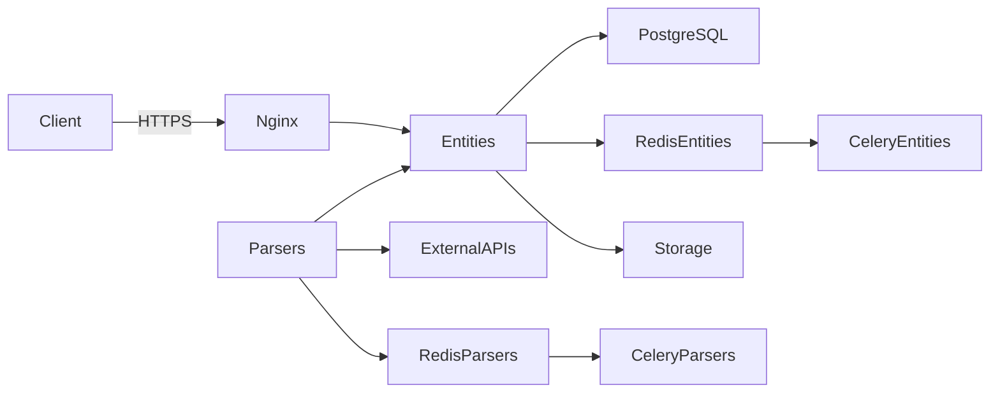
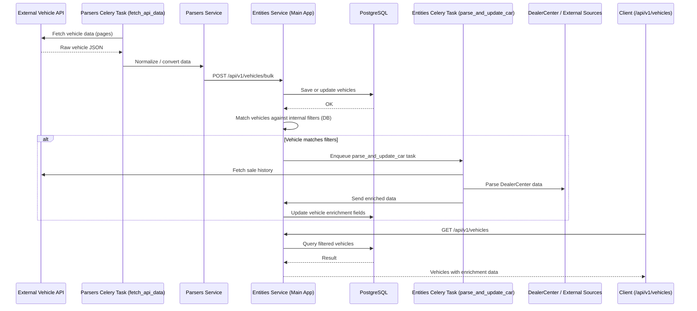

# Cars & Beyond (user_registration) — Technical Documentation

> **Purpose:** A two-service backend system for ingesting vehicle data from external sources (e.g., APICAR), persisting and managing it in a central API (“Entities”), and running background parsing/enrichment jobs via Celery.
This repository contains **two FastAPI applications**:
- **Entities service** (`entities/`) — main API + database (PostgreSQL) + storage (MinIO/S3) integration.
- **Parsers service** (`parsers/`) — integration/parsing layer (APICAR + scraping endpoints) + Celery tasks that push data into Entities.
It also ships a full local stack via **Docker Compose**: Postgres, pgAdmin, Redis (2 instances), MinIO, Nginx, and Celery workers/beat.
---
## Contents
- [Architecture](#architecture)
- [Tech Stack](#tech-stack)
- [Local Run (Docker)](#local-run-docker)
- [Environment Variables](#environment-variables)
  - [Entities `.env`](#entities-env)
  - [Parsers `.env`](#parsers-env)
  - [Nginx `.env` (optional)](#nginx-env-optional)
- [Services & Ports](#services--ports)
- [Inter-service Interaction](#inter-service-interaction)
- [Key Endpoints](#key-endpoints)
  - [Entities API](#entities-api)
  - [Parsers API](#parsers-api)
- [Background Jobs (Celery)](#background-jobs-celery)
- [Troubleshooting](#troubleshooting)
- [Production Notes](#production-notes)
## Architecture
High-level data flow:
1. **Parsers** fetches/creates updates from external APIs (e.g., APICAR).
2. Parsers **formats** raw data to the internal schema.
3. Parsers **pushes** vehicles to Entities via **bulk upsert** endpoint:
   - `POST http://entities:8000/api/v1/vehicles/bulk`
4. Entities saves/updates vehicles in Postgres, stores photo links, and triggers **enrichment parsing** via Celery task `parse_and_update_car`.
5. Parsers also periodically fetches “deleted lots” and calls Entities bulk delete endpoint:
   - `POST http://entities:8000/api/v1/vehicles/bulk/delete`
> **Important:** Inter-service requests from Parsers to Entities are authenticated by a shared token in the `X-Auth-Token` header (`PARSERS_AUTH_TOKEN`).
## Tech Stack
**Backend / API**
- FastAPI
- Pydantic
- httpx (sync/async HTTP client)
- Python 3.x (project uses pyproject.toml)
**Database**
- PostgreSQL 15
- SQLAlchemy (AsyncSession)
- Alembic migrations (via `migrator` service)
**Background processing**
- Celery
- Celery Beat
- Redis (two instances: one for Entities tasks, one for Parsers tasks)
**Object Storage**
- MinIO (local S3-compatible storage)
- S3 (prod mode supported via env vars)
**Infrastructure**
- Docker & Docker Compose
- Nginx (TLS termination for local/edge scenarios)
- pgAdmin for DB inspection
## Local Run (Docker)
### Prerequisites
- Docker Desktop / Docker Engine
- Docker Compose v2+
### Quick start
1) Create `.env` files from samples:
```bash
cp entities/.env.sample entities/.env
cp parsers/.env.sample parsers/.env
```
2) Fill required env variables (see [Environment Variables](#environment-variables)).
3) Start the stack:
docker compose up --build
> Compose will start Postgres, run Alembic migrations (migrator), then start Entities, Parsers, Celery workers, MinIO, etc.
### Stop & cleanup
docker compose down
To remove volumes too (️ deletes DB data):
docker compose down -v
## Environment Variables
The repo includes `entities/.env.sample` and `parsers/.env.sample`.  
For local development, you typically only need a subset, but below is a **complete** reference with explanations.
> **Tip:** For secrets like JWT keys, use long random strings.
### Entities `.env`
File: `entities/.env`
#### PostgreSQL (local, used by Compose `db`)
| Variable | Example | Required | Notes |
|---|---:|:---:|---|
| `POSTGRES_DB` | `a` |  | DB name |
| `POSTGRES_DB_PORT` | `5432` |  | Usually 5432 |
| `POSTGRES_USER` | `admin` |  | DB user |
| `POSTGRES_PASSWORD` | `a` |  | DB password |
| `POSTGRES_HOST` | `db` |  | Compose service name is `db` |
#### pgAdmin (optional, used by `pgadmin`)
| Variable | Example | Required |
|---|---:|:---:|
| `PGADMIN_DEFAULT_EMAIL` | `admin@gmail.com` |  (if you use pgAdmin) |
| `PGADMIN_DEFAULT_PASSWORD` | `admin` |  (if you use pgAdmin) |
#### JWT / Security (used by Entities API auth)
| `SECRET_KEY_ACCESS` | `...` |  | Access token signing key |
| `SECRET_KEY_REFRESH` | `...` |  | Refresh token signing key |
| `SECRET_KEY_USER_INTERACTION` | `...` |  | For email confirm / interaction tokens |
| `JWT_SIGNING_ALGORITHM` | `HS256` |  | Default `HS256` |
#### Token TTL settings (optional, but recommended to keep)
| `ACCESS_TOKEN_EXPIRE_MINUTES` | `30` |  |
| `ACCESS_KEY_TIMEDELTA_MINUTES` | `60` |  |
| `USER_INTERACTION_KEY_TIMEDELTA_DAYS` | `7` |  |
| `REFRESH_KEY_TIMEDELTA_MINUTES` | `1440` |  |
#### Email (for invitations / resets / confirmations)
| `SMTP_SERVER` | `smtp.gmail.com` |  | Needed if you use email features |
| `SMTP_PORT` | `587` |  | TLS port typically 587 |
| `SMTP_USER` | `...` |  | SMTP login |
| `SMTP_PASSWORD` | `...` |  | SMTP password/app password |
| `EMAIL_FROM` | `no-reply@domain.com` |  | Sender |
Additionally present in sample (legacy/compat):
| Variable | Notes |
|---|---|
| `LOGIN`, `PASSWORD` | Used as additional email credentials in some flows |
#### Cookies
| `COOKIE_PATH` | `/` |  |
| `COOKIE_SECURE` | `true` |  |
| `COOKIE_HTTPONLY` | `true` |  |
| `COOKIE_SAMESITE` | `None` |  |
#### Internal Auth between Parsers → Entities (**required**)
| `PARSERS_AUTH_TOKEN` | `super-secret-token` |  | Must match in Parsers `.env`; sent as `X-Auth-Token` header |
#### MinIO (local S3-compatible storage)
| `MINIO_ROOT_USER` | `minioadmin` |  | MinIO access key |
| `MINIO_ROOT_PASSWORD` | `some_password` |  | MinIO secret key |
| `MINIO_HOST` | `minio` |  | Compose service name |
| `MINIO_PORT` | `9000` |  | Default |
| `MINIO_STORAGE` | `cars-and-beyond-storage` |  | Bucket name created by `minio_mc` |
#### S3 (prod mode only)
Entities supports switching to “prod storage” if `ENVIRON=prod`. Then it uses S3 variables below:
| Variable | Required in prod |
|---|:---:|
| `S3_BUCKET_NAME` |  |
| `S3_REGION` |  |
| `S3_STORAGE_HOST` |  |
| `S3_STORAGE_PORT` |  (depends on infra) |
| `S3_ACCESS_KEY_ID` |  |
| `S3_SECRET_ACCESS_KEY` |  |
#### PostgreSQL (prod mode only)
Used when `ENVIRON=prod`:
| `POSTGRES_DB_HOST_PROD` |  |
| `POSTGRES_DB_PORT_PROD` |  |
| `POSTGRES_DB_USER_PROD` |  |
| `POSTGRES_DB_PASSWORD_PROD` |  |
| `POSTGRES_DB_NAME_PROD` |  |
#### Other variables in sample (project-specific / optional)
| `PROXY_HOST`, `PROXY_PORT` | Proxy support |
| `DC_USERNAME`, `DC_PASSWORD` | External system credentials (if used) |
| `ADMIN_USERNAME`, `ADMIN_PASSWORD`, `ADMIN_ONE_USERNAME`, `ADMIN_ONE_PASSWORD` | Admin bootstrap / notifications |
| `API_SOURCE` | `CIA` or `AC` (data source selection) |
| `ENVIRON` | `dev` or `prod` (switches DB/S3 config) |
| `ID`, `KEY` | GitHub deploy keys (if used) |
### Parsers `.env`
File: `parsers/.env`
#### Email (optional)
Same meaning as in Entities:
| Variable | Example |
| `SMTP_SERVER` | `smtp.gmail.com` |
| `SMTP_PORT` | `587` |
| `SMTP_USER` | `...` |
| `SMTP_PASSWORD` | `...` |
| `EMAIL_FROM` | `no-reply@domain.com` |
| `LOGIN`, `PASSWORD` | Legacy/compat |
#### Proxy (optional)
| `PROXY_HOST`, `PROXY_PORT` | Used for scraping/external calls |
#### Inter-service Auth token (**required**)
Must match `entities/.env`:
| Variable | Required |
| `PARSERS_AUTH_TOKEN` |  |
#### External API keys (required for full ingestion)
| Variable | Required | Notes |
|---|:---:|---|
| `APICAR_KEY` |  | Used to call `https://api.apicar.store/...` |
| `AUCTION_IO_KEY` |  | Present in sample; required only if that integration is enabled |
| `DC_USERNAME`, `DC_PASSWORD` |  | Used by `/scrape/dc` if enabled |
#### Environment selector
| `ENVIRON` | `dev` |
#### Data source switch
| Variable | Example | Notes |
|---|---|---|
| `API_SOURCE` | `CIA` or `AC` | Same convention as Entities |
### Nginx `.env` (optional)
File: `docker/nginx/.env`
Used by Nginx container for basic auth variables (if configured in nginx conf):
| `API_USER` | `admin` |
| `API_PASSWORD` | `...` |
> If you do not use the Nginx service locally, you can ignore this file.
## Services & Ports
Default ports exposed by `compose.yaml`:
| Service | Container | Port(s) |
| Entities API | `backend_cars_and_beyond` | `8000:8000` |
| Parsers API | `parser_cars_and_beyond` | `8001:8001` |
| Postgres | `postgres_cars_and_beyond` | `5432:5432` |
| pgAdmin | `pgadmin_cars_and_beyond` | `3333:80` |
| Redis (Parsers) | `redis_cars_and_beyond` | `6379:6379` |
| Redis (Entities) | `redis_1_cars_and_beyond` | `6380:6380` |
| MinIO | `minio_cars_and_beyond` | `9000`, `9001` |
| Nginx (TLS) | `nginx` | `443:443` |
## Inter-service Interaction
### Authentication between services
Entities protects internal endpoints (bulk ingestion/delete) using:
- Header: `X-Auth-Token: <PARSERS_AUTH_TOKEN>`
- Token must equal the env var `PARSERS_AUTH_TOKEN` on the Entities side.
### Main ingestion flow (Parsers → Entities → Celery)
1) Parsers Celery task `fetch_api_data` pulls pages from APICAR:
- `GET https://api.apicar.store/api/cars/db/update?size=...&page=...`
2) Parsers formats cars and sends them in batches of 200:
- `POST http://entities:8000/api/v1/vehicles/bulk`
- body: `{ "ivent": "updated"|"created", "vehicles": [ ... ] }`
3) Entities saves data, commits, then enqueues enrichment tasks:
- Celery task: `tasks.task.parse_and_update_car`
- queue: `car_parsing_queue`
### Deletion flow
1) Parsers task `delete_vehicle` pulls list from:
- `GET https://api.apicar.store/api/cars/deleted`
2) Parsers sends `{"data": [...]}` in batches of 200:
- `POST http://entities:8000/api/v1/vehicles/bulk/delete`
3) Entities updates relevance / deletes and commits.
## Key Endpoints
> Base URL (local):  
> - Entities: `http://localhost:8000`  
> - Parsers: `http://localhost:8001`
### Entities API
Routers are mounted under: `GET/POST ... /api/v1/*`
#### Auth
| Method | Path | Purpose |
| POST | `/api/v1/sign-up/` | Register user |
| POST | `/api/v1/login/` | Login |
| POST | `/api/v1/refresh/` | Refresh tokens |
| POST | `/api/v1/logout/` | Logout |
#### Users
| GET | `/api/v1/me/` | Current user profile |
| PATCH | `/api/v1/me/` | Update profile |
| POST | `/api/v1/change-password/` | Change password |
| POST | `/api/v1/change-email/` | Change email |
| GET | `/api/v1/confirm-email/` | Confirm email |
| POST | `/api/v1/password-reset/request/` | Request reset |
| POST | `/api/v1/password-reset/confirm/` | Confirm reset |
| POST | `/api/v1/send-invite/` | Send invite |
| GET | `/api/v1/roles/` | List roles |
| POST | `/api/v1/assign-role/` | Assign role |
#### Vehicles (core)
| GET | `/api/v1/` | List vehicles (filters/ordering inside) |
| GET | `/api/v1/{car_id}/` | Get vehicle details |
| GET | `/api/v1/filter-options/` | Filter values/options |
| POST | `/api/v1/bulk` | **Internal**: bulk ingest (Parsers → Entities) |
| POST | `/api/v1/bulk/delete` | **Internal**: bulk delete/relevance update |
| POST | `/api/v1/upsert` | Manual/Single upsert (also triggers Celery) |
| POST | `/api/v1/cars/{car_id}/scrape` | Trigger scrape/enrichment |
| PATCH | `/api/v1/cars/{car_id}/check` | Mark checked |
| PUT | `/api/v1/{car_id}/status/` | Update car status |
| PUT | `/api/v1/cars/{car_id}/costs` | Update costs |
| POST | `/api/v1/cars/{car_id}/like-toggle` | Like/unlike |
| POST | `/api/v1/update-car-info/{vehicle_id}` | Pull data from Parsers by VIN |
| GET | `/api/v1/is_available/{vin}` | Check VIN availability |
##### Internal Bulk Ingest — request example
curl -X POST "http://localhost:8000/api/v1/vehicles/bulk" \
  -H "Content-Type: application/json" \
  -H "X-Auth-Token: YOUR_PARSERS_AUTH_TOKEN" \
  -d '{
    "ivent": "updated",
    "vehicles": [
      {
        "vin": "1HGCM82633A123456",
        "vehicle": "Honda Accord",
        "make": "Honda",
        "model": "Accord",
        "year": 2016,
        "mileage": 120000,
        "auction": "copart",
        "lot": 12345678,
        "photos": [],
        "photos_hd": [],
        "condition_assessments": []
      }
    ]
  }'
##### Internal Bulk Delete — request example
curl -X POST "http://localhost:8000/api/v1/vehicles/bulk/delete" \
    "data": [
      {"id": "uuid", "lot_id": 75423005, "site": 3, "created_at": "2026-02-24T15:21:36.804Z", "updated_at": "2026-02-24T15:21:36.804Z"}
> Expected response: **204 No Content** on success.
#### Analytics
| Method | Path |
| GET | `/api/v1/recommended-cars` |
| GET | `/api/v1/top-sellers` |
| GET | `/api/v1/sale-prices` |
| GET | `/api/v1/locations-by-lots` |
| GET | `/api/v1/avg-final-bid-by-location` |
| GET | `/api/v1/volumes` |
| GET | `/api/v1/sales-summary` |
#### Admin / Filters / ROI
| POST | `/api/v1/filters` |
| GET | `/api/v1/filters` |
| GET | `/api/v1/filters/{filter_id}` |
| PATCH | `/api/v1/filters/{filter_id}` |
| DELETE | `/api/v1/filters/{filter_id}` |
| GET | `/api/v1/roi` |
| GET | `/api/v1/roi/calculate` |
| GET | `/api/v1/roi/latest` |
| POST | `/api/v1/roi` |
| POST | `/api/v1/upload-iaai-fees` |
| POST | `/api/v1/load-db` |
#### Inventory & Parts
Entities includes a full inventory module:
- Vehicles inventory endpoints under `/api/v1/vehicles/*`
- Parts inventory endpoints under `/api/v1/parts/*`
### Parsers API
Mounted under `/api/v1`.
#### APICAR integration
| GET | `/api/v1/apicar/get/{car_vin}` | Fetch raw APICAR data |
| GET | `/api/v1/apicar/update/{car_vin}` | Update data for VIN |
> Note: Entities calls Parsers internally for some flows (e.g., update-car-info by VIN).
#### Scraping
| GET | `/api/v1/scrape/dc` |
| POST | `/api/v1/scrape/current_bid` |
| GET | `/api/v1/scrape/fees` |
| POST | `/api/v1/scrape/iaai/fees` |
#### Manual trigger ingestion
| POST | `/startup` | Triggers `fetch_api_data` task once |
Example:
curl -X POST "http://localhost:8001/startup"
## Background Jobs (Celery)
### Parsers Celery (`parsers/tasks/tasks.py`)
- Broker/Backend: `redis://redis:6379/0`
- Beat schedule:
  - `fetch_api_data` every hour
  - `delete_vehicle` periodically (configured by crontab minute=5 in code)
Key tasks:
- `fetch_api_data(size=1000, base_url=...)`  
  Streams pages from APICAR and forwards to Entities in batches of 200.
- `delete_vehicle()`  
  Fetches deleted lots and calls Entities bulk delete in batches of 200.
### Entities Celery
Entities runs Celery worker/beat using:
- Broker on `redis_1:6380` (configured in Entities celery config)
- Queue: `car_parsing_queue`
- Task: `tasks.task.parse_and_update_car`  
  Enrichment/parsing task invoked after bulk save or upsert.
## Troubleshooting
### 1) `401 Invalid token` when calling internal endpoints
- Ensure `PARSERS_AUTH_TOKEN` is set **and identical** in:
  - `entities/.env`
  - `parsers/.env`
- Ensure header name is exactly `X-Auth-Token`.
### 2) Migrations not applied / Entities crashes on startup
- `migrator` service must complete successfully.
- Run: `docker compose logs migrator`
### 3) Postgres healthcheck fails
- Verify `POSTGRES_USER`, `POSTGRES_PASSWORD`, `POSTGRES_DB`
- Run: `docker compose logs db`
### 4) APICAR requests failing
- Ensure `APICAR_KEY` is correct in `parsers/.env`
- Check network access from container
### 5) Celery tasks not running
- Check Redis health:
  - `docker compose logs redis`
  - `docker compose logs redis_1`
- Check Celery logs:
  - `docker compose logs celery`
  - `docker compose logs celery_worker`
  - `docker compose logs celery_beat`
## Production Notes
- There is a `compose.prod.yaml` file with resource limits and logging options.
- To run prod stack on a VM:
  - Provide `ENVIRON=prod` and fill prod DB/S3 env vars (Entities).
- Replace local TLS certs (`cert.pem`, `key.pem`) with real certificates if exposing Nginx.
## Swagger / OpenAPI
- Entities: `https://localhost/docs`
- Parsers: `http://localhost:8001/docs`
## Support / Handover Checklist
Before handing to a customer:
-  `.env` files filled (Entities + Parsers)
-  `PARSERS_AUTH_TOKEN` matches in both apps
-  APICAR credentials provided (`APICAR_KEY`)
-  `docker compose up --build` verified locally
-  Swagger endpoints reachable
#  Cars & Beyond — Enterprise Architecture & Technical Documentation
# 1. Executive Summary
Cars & Beyond is a distributed backend platform designed for:
- Vehicle ingestion from external providers
- Data normalization and enrichment
- Inventory and analytics management
- ROI calculations and reporting
- Background processing and automation
- Secure multi-user access with roles
The system follows a **service‑oriented architecture** composed of two primary FastAPI applications:
1. **Entities Service** — Core business domain, database, authentication, analytics
2. **Parsers Service** — External integrations, ingestion pipelines, background processing
Infrastructure is containerized via Docker and orchestrated with Docker Compose locally or ECS in production.
# 2. High-Level Architecture
## Components
- Nginx (TLS Reverse Proxy)
- Entities API (FastAPI)
- Parsers API (FastAPI)
- PostgreSQL Database
- Redis (Queues)
- Celery Workers
- MinIO / AWS S3 Storage
- pgAdmin (Admin UI)
## Architecture Diagram

# 3. Technology Stack
## Backend
- Python 3.12
- SQLAlchemy (Async ORM)
- Alembic
## Background Processing
- Redis
## Storage
- PostgreSQL
- MinIO (local)
- AWS S3 (production)
## Infrastructure
- Docker
- Docker Compose
- Nginx TLS Proxy
## Networking
- Internal service communication via Docker network
- Token-based internal authentication
# 4. Service Responsibilities
## Entities Service
Responsibilities:
- Authentication & Authorization
- Vehicle storage and management
- Analytics & reporting
- Inventory system
- ROI calculation
- Internal APIs for Parsers
- Background enrichment tasks
## Parsers Service
- External API communication
- Data ingestion pipelines
- Data transformation
- Scheduling background tasks
- Synchronization with Entities
# 5. Data Flow
### Vehicle Ingestion Flow
sequenceDiagram
    participant External
    participant Parsers
    participant Entities
    participant DB
    Parsers->>External: Fetch vehicle data
    External-->>Parsers: JSON
    Parsers->>Entities: POST bulk vehicles
    Entities->>DB: Save records
    DB-->>Entities: OK
### Vehicle Deletion Flow
    Parsers->>External: Fetch deleted list
    Parsers->>Entities: POST bulk delete
    Entities->>DB: Update status
# 6. Local Deployment
## Step 1 — Clone
git clone <repository>
cd project
## Step 2 — Configure Environment
## Step 3 — Run
## Access URLs
| Service | URL |
|---------|-----|
Main API | https://localhost/docs |
Parsers | http://localhost:8001/docs |
pgAdmin | http://localhost:3333 |
MinIO | http://localhost:9001 |
Self-signed certificate warning is expected.
# 7. Environment Variables
## Entities `.env`
### Database
POSTGRES_DB=  
POSTGRES_USER=  
POSTGRES_PASSWORD=  
POSTGRES_HOST=db  
POSTGRES_DB_PORT=5432  
### JWT
SECRET_KEY_ACCESS=  
SECRET_KEY_REFRESH=  
SECRET_KEY_USER_INTERACTION=  
JWT_SIGNING_ALGORITHM=HS256  
### Internal Communication
PARSERS_AUTH_TOKEN=  
### Storage
MINIO_ROOT_USER=  
MINIO_ROOT_PASSWORD=  
MINIO_HOST=minio  
MINIO_PORT=9000  
MINIO_STORAGE=  
### Environment
ENVIRON=dev  
## Parsers `.env`
APICAR_KEY=  
AUCTION_IO_KEY=  
# 8. Docker Services
| Service | Purpose |
|---------|---------|
nginx | HTTPS reverse proxy |
entities | Core API |
parsers | Integration API |
postgres | Database |
redis | Queue |
celery | Workers |
minio | Object storage |
# 9. API Overview
## Entities Endpoints
Authentication:
- POST /api/v1/login
- POST /api/v1/sign-up
- POST /api/v1/refresh
Vehicles:
- GET /api/v1/
- POST /api/v1/upsert
- POST /api/v1/vehicles/bulk
- POST /api/v1/vehicles/bulk/delete
Analytics:
- GET /api/v1/recommended-cars
- GET /api/v1/top-sellers
Full documentation available in Swagger.
## Parsers Endpoints
- GET /api/v1/apicar/get/{vin}
- GET /api/v1/apicar/update/{vin}
- POST /startup
# 10. Background Jobs
## Parsers Tasks
fetch_api_data — ingestion pipeline  
delete_vehicle — bulk deletion  
## Entities Tasks
parse_and_update_car — enrichment  
kickoff_parse_for_filter — filter parsing  
send_daily_car_audit — reporting  
# 11. Security Architecture
- JWT authentication
- Role-based permissions
- Internal token validation
- HTTPS via Nginx
- Environment-based secrets
Production recommendation:
- Secrets Manager
- Private VPC networking
- IAM roles
# 12. Performance & Scaling
Horizontal scaling supported for:
- Entities API
- Parsers API
- Celery workers
Scaling strategies:
- Increase worker concurrency
- Separate read replicas
- Redis clustering
- Queue partitioning
# 13. AWS Deployment
Recommended architecture:
- RDS PostgreSQL
- ElastiCache Redis
- S3 Storage
- EC2 + Docker Compose
# 14. Developer Onboarding
Steps:
1. Configure environment
2. Run Docker
3. Open Swagger
4. Review logs
Commands:
docker compose logs -f
docker compose restart
docker compose build
# 15. Troubleshooting
## Cannot open https://localhost/docs
Accept browser certificate warning.
## Internal 401
Check PARSERS_AUTH_TOKEN.
## Celery not processing
Check Redis and workers.
# 16. Handover Checklist
- Environment configured
- Services running
- Swagger accessible
- Background jobs active
- Database connected




# End of Document